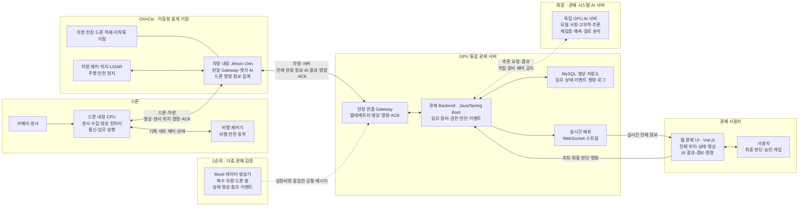
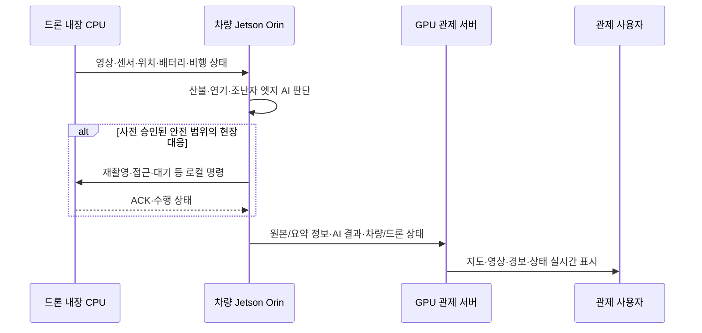
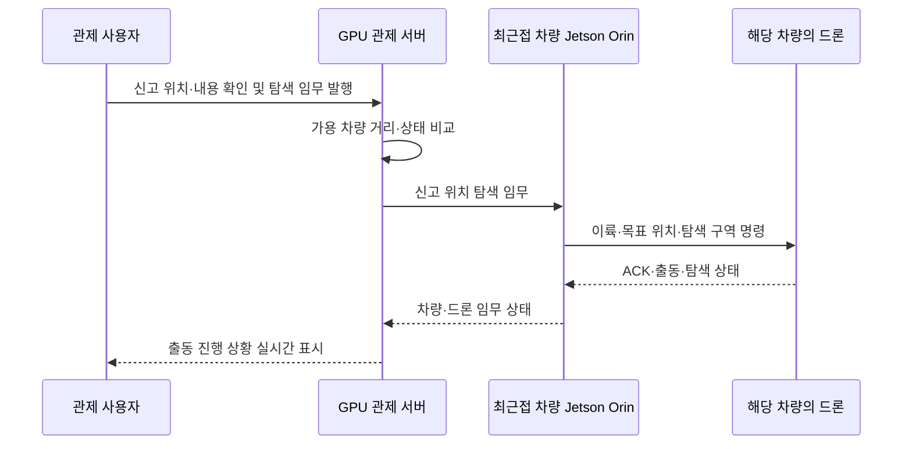
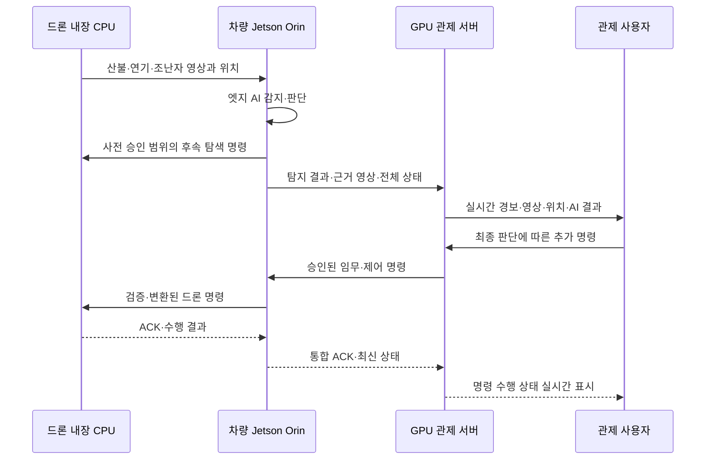

# 산불·조난 대응 드론·OrinCar 통합 관제 시스템 아키텍처 Blueprint

| 항목 | 내용 |
|---|---|
| 문서 버전 | v0.4 |
| 작성 기준일 | 2026-07-14 |
| 문서 목적 | 드론 내장 CPU·차량 탑재 Jetson Orin·GPU 관제 서버·웹 UI 간 역할과 통신 경로, 관제 시스템 AI 서버 확장 방안 정의 |
| 기준 | 4주 MVP 통신·배치 구조 초안 |
| 핵심 경로 | `드론 ↔ 차량`, `차량 ↔ 관제 서버`의 2구간 통신만 허용 |
| 표기 | 실선은 MVP 기본 경로, 점선은 2순위 mock 또는 확장 구성 경로 |

## 1. 전체 아키텍처

### 1.1 배치와 책임

| 구성 요소 | 배치 | 기본 책임 |
|---|---|---|
| 드론 내장 CPU | 드론 내부 | 카메라·센서 데이터 수집, 영상 전처리, 비행 제어기 연동, 차량과의 통신, 수신 임무 수행 |
| Jetson Orin | OrinCar 내부 | 드론과 관제 서버 사이의 유일한 현장 Gateway, 현장 데이터 집계, 산불·연기·조난자 엣지 AI 판단, 사전 승인된 범위의 드론 명령 |
| OrinCar | 현장 이동 차량 | 차량 천장에 드론을 적재·운반하는 이동형 중계 거점, 신고 지점 인근으로 이동, 드론 출동·회수 지원 |
| GPU 관제 서버 | 관제센터 | 모든 차량·드론 정보 수집·저장·실시간 배포, 임무·사용자 권한·명령·ACK·감사 관리; MVP에서는 서버 측 AI 추론을 수행하지 않음 |
| 독립 GPU AI 서버(확장) | 관제 시스템 AI 영역 | 관제 Backend가 전달한 영상·센서·이벤트의 고부하 추론, 모델 서빙·버전·GPU 자원 관리, 재검증·확산 예측·경로 분석 결과 반환; 장비 직접 제어 금지 |
| 관제 사용자 | 웹 관제 UI | 전체 현황 상시 확인, AI 결과 검토, 최종 판단, 임무 변경·복귀·재탐색 등 추가 명령 |
| Mock 데이터 생성기 | 개발·시험 환경 | 2순위 다중 관제 기능을 위해 복수 차량·드론 쌍의 상태와 이벤트 생성 |

## 2. 데이터·명령 흐름

### 2.1 평시 순찰과 현장 탐지

차량과 드론은 평시에 함께 순찰한다. 드론이 수집한 정보는 먼저 차량의 Jetson Orin으로 전달되며, Orin은 현장 AI 판단과 필요한 로컬 명령을 수행한 뒤 원본 참조·AI 결과·전체 장비 상태를 관제 서버에 전송한다.

### 2.2 신고 접수와 최근접 차량 출동

관제 서버는 신고 위치와 가용 상태를 기준으로 가장 가까운 차량을 선택 또는 추천한다. 명령 대상은 차량이며, 차량의 Jetson Orin이 천장에 적재된 해당 드론에 구체적인 비행·탐색 명령을 전달한다.

### 2.3 탐지 결과와 사용자 최종 명령

사용자 명령은 드론으로 직접 전송하지 않는다. 반드시 `관제 사용자 → 관제 서버 → 차량 Jetson Orin → 드론 내장 CPU` 순서로 이동하고, 수행 결과는 역순으로 회신한다.

## 3. 통신 규격 요약

| 연결 구간 | 기본 규격 후보 | 전송 내용 | 상태 |
|---|---|---|---|
| 카메라·센서 → 드론 내장 CPU | USB·UART·MIPI CSI-2·GPIO 등 | 영상·센서 원시 데이터 | 실제 장비에 따라 확정 |
| 드론 내장 CPU ↔ 비행 제어기 | MAVLink 2 또는 기체 SDK | 위치·비행 상태·임무·제어·ACK | 기체 선정 후 확정 |
| 드론 내장 CPU ↔ 차량 Jetson Orin | MQTT 또는 경량 메시지 채널 | 텔레메트리·AI용 메타데이터·명령·ACK | MVP 기본 제어·상태 경로 |
| 드론 내장 CPU → 차량 Jetson Orin | WebSocket Binary·RTSP 등 별도 영상 채널 | 실시간 영상·스냅샷 | 제어·상태 채널과 분리 |
| 차량 Jetson Orin ↔ 관제 서버 | MQTT | 차량·드론 상태, Orin AI 결과, 서버 명령, 통합 ACK | MVP 기본 제어·상태 경로 |
| 차량 Jetson Orin → 관제 서버 | WebSocket Binary·RTSP 등 별도 영상 채널 | 드론·차량 영상 | 제어·상태 채널과 분리 |
| 사용자 UI ↔ 관제 서버 | HTTP/JSON | 조회·판단·승인·명령·응답 | 기본 규격 |
| 관제 서버 → 사용자 UI | WebSocket·영상 스트림 | 전체 장비 상태·영상·AI 결과·경보·명령 결과 | 상시 실시간 제공 |
| 관제 Backend ↔ 독립 AI 서버 | HTTP/JSON·gRPC 또는 메시지 큐 | 영상·센서·이벤트·추론 요청, AI 결과·신뢰도·근거·모델 버전·작업 상태 | 확장 방안 |
| 관제 서버 ↔ MySQL·영상 저장소 | Spring Data JPA/JDBC·객체 저장 API | 임무·장비·이벤트·명령·로그·영상 참조 | MySQL과 영상 저장 방식 상세 확정 필요 |
| Mock 데이터 생성기 → 관제 서버 | 실장비와 동일한 메시지·영상 참조 규격 | 복수 차량·드론 쌍의 가상 상태·이벤트 | 2순위 다중 관제 시험 |

물리 네트워크는 Wi-Fi·LTE/5G 등 현장 조건에 따라 별도 확정한다. 물리망과 관계없이 논리 통신 경로는 `드론 ↔ 차량 ↔ 관제 서버`를 유지한다.

## 4. 공통 인터페이스 원칙

- 드론은 관제 서버와 직접 통신하지 않는다. 모든 드론 데이터와 명령은 차량의 Jetson Orin을 경유한다.
- Jetson Orin은 차량 내부에 탑재되며, 드론·차량 정보를 묶어 관제 서버에 전달하는 `gateway` 역할을 한다.
- 차량과 드론은 명시적인 1:N 또는 1:1 페어링 정보를 유지한다. MVP의 실제 장비는 1:1 페어를 기준으로 하고 다중 페어는 mock으로 검증한다.
- `gateway_id`는 서버에 접속하는 차량 Jetson Orin을, `vehicle_id`와 `drone_id`는 논리 장비를 각각 식별한다.
- `source` 값으로 `real`, `mock`, `replay`를 구분한다.
- 영상 경로는 텔레메트리·명령·ACK 경로와 분리하되, 같은 `mission_id`, `event_id`, 촬영 시각과 위치로 연결한다.
- Orin 엣지 AI가 내리는 명령은 `issuer=edge_ai`, 관제 사용자가 내리는 명령은 `issuer=operator`로 구분한다.
- Orin의 자동 명령은 사전 승인된 안전 범위로 제한한다. 관제 사용자는 전체 정보를 바탕으로 최종 판단하고 임무를 변경·중지·복귀시킬 수 있다.
- 확장 AI 서버는 관제 Backend하고만 통신하며 차량·드론에 직접 연결하거나 제어 명령을 발행하지 않는다.
- 명령에는 `command_id`, `parent_command_id`, 발행 시각, 만료 시각, 대상 장비, 발행자와 목표 동작을 포함한다.
- 각 구간은 명령 결과를 `ACK`, `RUNNING`, `SUCCEEDED`, `FAILED`, `EXPIRED` 중 하나로 회신하고, 차량은 드론 응답을 서버 명령과 연결한다.
- 서버가 발행한 드론 대상 명령은 Jetson Orin이 권한·무결성·유효시간·안전 한계를 검증한 뒤 드론 명령으로 변환·전달한다.
- 중복·만료·권한 없는 명령은 실행하지 않고 거부 사유를 기록한다.
- 비상 정지·충돌 회피·저전력 복귀 등 현장 안전 동작은 네트워크 명령보다 우선한다.

## 5. 장애 시 기본 동작

| 장애 구간 | 기본 동작 |
|---|---|
| 드론 ↔ 차량 단절 | 드론은 사전 정의된 대기·복귀·착륙 중 안전 정책을 수행하고, 차량은 마지막 상태와 단절 경보를 서버로 전송한다. |
| 차량 ↔ 관제 서버 단절 | Jetson Orin은 제한된 로컬 판단과 안전 정책만 유지하며, 연결 복구 후 누락 이벤트·명령 결과를 재동기화한다. |
| 관제 UI 연결 단절 | 서버는 현장 데이터 수집과 저장을 계속하고, UI 재접속 시 최신 상태와 미확인 경보를 복구한다. |
| Orin AI 추론 실패 | 자동 후속 명령을 중단하거나 보수적 대기 명령으로 전환하고 원본 데이터와 실패 상태를 서버에 보고한다. |
| 독립 AI 서버 장애·지연(확장) | 관제 Backend가 timeout·재시도·회로 차단을 적용하고 Orin 결과·원본 정보·기존 명령 경로를 유지하며, 대시보드에 AI 서버 분석 불가 상태를 표시한다. |

## 6. 우선순위와 확장 방안

### 6.1 구현 우선순위

1. **1순위(MVP)**: 실제 드론 내장 CPU ↔ 차량 Jetson Orin ↔ GPU 관제 서버 연결, Orin 엣지 AI 판단, 실시간 통합 화면, 사용자 최종 명령 경로
2. **2순위**: Mock 데이터를 이용한 복수 차량·드론 쌍의 다중 관제, 동시 경보·명령·상태 표시와 부하 검증

### 6.2 확장 방안

- **관제 시스템 AI 서버 추가**: MVP에는 서버 측 AI를 두지 않고 차량 Jetson Orin을 기본 AI로 사용한다. 확장 단계에서 독립 GPU AI 서버를 새로 추가하여 고부하 추론, 모델 서빙, 산불·연기·조난자 재검증, 산불 확산 예측과 경로 분석을 담당한다.
- **연동 경로**: `차량 Jetson Orin → 관제 서버 → AI 서버 → 관제 서버 → 관제 UI` 순서로 데이터와 결과를 교환한다.
- **제어 분리**: AI 서버는 결과·신뢰도·근거·후보 행동만 반환하며, 차량·드론 직접 연결과 명령 발행을 금지한다. 사용자 명령 경로는 `관제 서버 → 차량 → 드론`을 유지한다.
- **확장성과 운영**: 추론 API 또는 메시지 큐, 작업 상태, 모델 버전·배포, GPU 자원·부하, timeout·재시도·모니터링을 분리하고 필요 시 AI 서버 인스턴스를 수평 확장한다.
- **장애 격리**: AI 서버가 실패해도 현장 데이터 수집, Orin 엣지 결과, 관제 화면과 기존 명령 경로는 계속 동작해야 한다.
- **선택 확장**: 필요 시 3D 시뮬레이터를 mock 데이터 공급원으로 연결한다.

### 6.3 추가 확정이 필요한 항목

1. 드론 내장 CPU와 비행 제어기의 기종·SDK·내부 연결 규격
2. 드론 ↔ 차량, 차량 ↔ 서버의 물리 네트워크와 제어·영상 프로토콜
3. 차량 천장 드론 적재·고정·이착륙·회수·충전 방식과 안전 조건
4. Jetson Orin에서 자동 실행할 AI 모델, 신뢰도 임계값과 허용 명령 범위
5. MVP Jetson Orin AI와 확장 독립 AI 서버 사이의 모델·추론 책임 분리
6. 최근접 차량 선정 기준(거리, 통신 상태, 배터리, 탑재 드론 가용성, 도로 접근성)
7. 실시간 정보의 갱신 주기, 영상 지연·화질, 저장 범위와 보관 기간
8. Mock 다중 관제의 목표 차량·드론 수, 데이터 생성 주기와 부하 기준
9. MQTT topic·QoS·인증, 영상 endpoint·재연결·버퍼링 정책
10. 독립 AI 서버 도입 시점, GPU 규모, 추론 API·작업 큐, 모델 배포·모니터링, timeout·fallback과 직접 제어 금지 경계
