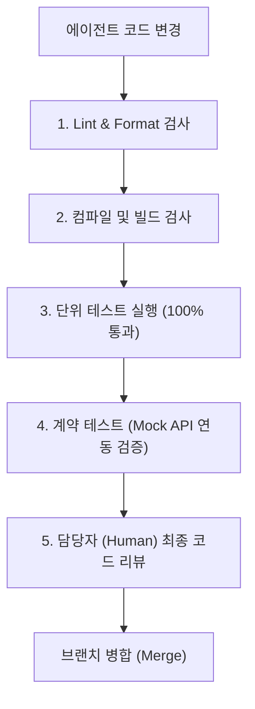

# AI Agent Development Rules & Harness (`AGENTS.md`)

This document defines the rules, permissions, boundaries, and validation gates for any AI coding agents (including Antigravity, LLM-based assistants, and developer scripts) operating within the `S15P11A302` repository. 

All agents **MUST** read and adhere to these guidelines before suggesting or writing any code.

---

## 1. AI Agent Sandbox & Permission Boundaries

To ensure safety, prevent data loss, and maintain codebase integrity, the following rules apply:

### 1.1 Forbidden Operations (사람의 명시적 승인 필수)
- **GPIO / Hardware Control**: Agents are **strictly forbidden** from executing code that directly interacts with real hardware GPIO pins, PCA9685 boards, LiDAR sensors, or drone flight controllers unless explicitly supervised by a human in a safe test environment.
- **Dependency Modification**: Do not modify `package.json`, `pom.xml`, `requirements.txt`, or install new dependencies without notifying the team.
- **Destructive Commands**: Running commands like `rm -rf`, `git reset --hard` (outside sandbox), or database drops is strictly forbidden.
- **Secrets & Credentials**: Never write API keys, database passwords, or device keys directly to source code. Use `.env` templates or environment variables.

### 1.2 File Access Boundaries
Agents must respect the role-based code separation:
- **Embedded/Orin Car Code**: Modify only files inside the `AI` (for Edge models) or specific embedded paths (to be defined).
- **Server/Backend Code**: Modify only files inside the `Server` directory.
- **Platform/Frontend Code**: Modify only files inside the `Platform` directory.
- **Documentation**: All documentation updates should be placed inside `docs/` or `README.md`.

---

## 2. Part-Specific Code Guidelines

### 2.1 Embedded & Edge AI (`AI/`, `Embedded/`)
- Language: Python / C++
- **Watchdog & Watchdog Policy**: Any script running motors or flight control must implement a watchdog timer. If the controller loses heartbeat from the software gateway, it must immediately default to a safe state (Stop motors / Hover drone).
- **Resource Management**: Jetson Orin models must run within pre-allocated GPU/memory limits to avoid OOM crashes affecting the vehicle's driving control.

### 2.2 Server Backend (`Server/`)
- Language: Java (Spring Boot) / Go (depending on final choice, default is Spring Boot as per blueprint)
- **Transactional Integrity**: All mission state transitions and commands must be logged transactionally.
- **Validation**: Any control commands received from the API must be checked for permissions, target pairing validity, and expiration timestamp before being sent to the Orin Gateway.

### 2.3 Platform Frontend (`Platform/`)
- Language: JavaScript/TypeScript (Vue.js / React)
- **Fail-Safe UI**: If the WebSocket connection is lost, display a clear reconnection banner. Do not freeze the interface.
- **Immediate Emergency Button**: The "Emergency Stop" or "Recall" buttons must be highly visible and immediately bypass standard queues to send commands.

---

## 3. Mandatory Validation Gates (검증 게이트)

Before any code change is merged, the following checks must pass:

1. **Lint & Static Analysis**: Run static analysis tool of the respective stack (e.g., ESLint for Frontend, SpotBugs/Checkstyle for Backend, Ruff/Pylint for Python).
2. **Build Verification**: The project must compile successfully (e.g., `./gradlew build` or `npm run build`).
3. **Unit Tests**: All unit tests must pass. Regression in existing tests is considered a blocker.
4. **Mock Integration Testing**: API changes must be validated against the shared API contract using the mock data server before testing with actual hardware.

---

## 4. How to Report Work
When completing a task, the AI agent must output:
1. **Summary of Changes**: Files added, modified, or deleted.
2. **Test Evidences**: Logs or terminal outputs demonstrating that unit and contract tests passed.
3. **Assumptions & Risks**: Any assumptions made about hardware behavior or network constraints.
