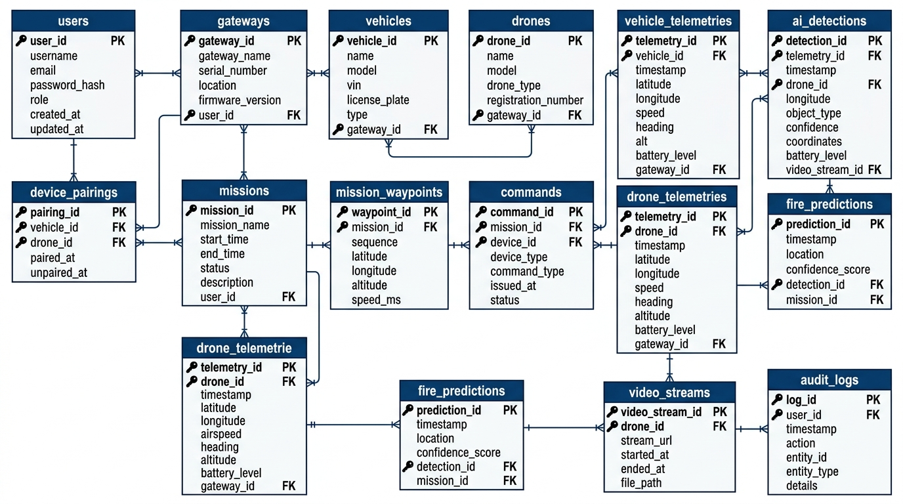

# 산불·조난 대응 드론·OrinCar 통합 관제 시스템 ERD 설계안

본 문서는 **산불·조난 대응 드론 및 Jetson Orin 탑재 차량(OrinCar) 통합 관제 시스템**을 위한 메인 관제 서버의 관계형 데이터베이스(RDB) ERD 설계안입니다. 
제시된 기능 명세서 v0.5의 요구사항, 아키텍처 구조, 보안 및 제어 흐름(2구간 통신 라우팅, 명령 추적, 사용자 판정 및 감사 등)을 충족할 수 있도록 테이블 구조와 관계를 설계하였습니다.

---

## 1. 데이터베이스 설계 원칙 및 특징

1. **2구간 명령 및 상태 추적 보장 (`parent_command_id`)**
   - 관제 사용자가 내린 명령이 차량(Gateway)을 통해 드론으로 전송될 때, `commands` 테이블의 `parent_command_id` 자가 참조 외래키를 활용하여 **[서버 원본 명령]**과 **[차량 중계 명령]**의 인과관계 및 결과 상태(ACK, SUCCEEDED 등)를 역순으로 추적할 수 있도록 설계했습니다.
2. **동적 물리 페어링 관리 (`device_pairings`)**
   - 드론이 특정 차량 천장에 적재 및 이착륙하므로, 1:1 관계를 고정하지 않고 `device_pairings` 테이블을 통해 이력 관리가 가능한 N:M 매핑을 지원합니다.
3. **텔레메트리 데이터의 분리 및 참조 무결성**
   - 드론과 차량의 센서 정보 및 상태(배터리, 속도, 고도 등)는 대용량 시계열 성격을 띠므로 각각 `vehicle_telemetries` 및 `drone_telemetries`로 분리하여 외래키 무결성을 강제합니다.
4. **AI 탐지와 최종 판단 연결 (`ai_detections`)**
   - Jetson Orin(Edge) 및 관제 서버 GPU에서 탐지된 이벤트(`forest_fire`, `smoke`, `distressed_person`)의 Bounding Box, 위치, 신뢰도를 기록하고, 관제 사용자의 최종 판정(`operator_judgment`, 판정 사유)과 조작 이력을 관리합니다.
5. **보안 신뢰 경계 및 감사 (`audit_logs`)**
   - 권한에 기반한 조작(Role-based Access Control), 세션 로그인 및 중요 제어 명령에 대한 변경 이력을 감사(Audit) 로그로 별도 보관합니다.

---

## 2. ERD 다이어그램 (ERD Diagram)

```mermaid
graph TD
    root["통합 시스템 DB 역할 매핑"] --> Embedded["임베디드 파트 (윤주한)"]
    root --> AI["인공지능 파트 (장민규)"]
    root --> Backend["관제 서버 파트 (변준성)"]
    root --> Platform["플랫폼 파트 (전우석)"]

    Embedded --> gateways["gateways (기기 등록)"]
    Embedded --> vehicles["vehicles (차량 상태)"]
    Embedded --> drones["drones (드론 상태)"]
    Embedded --> pairings["device_pairings (도킹)"]
    Embedded --> v_tel["vehicle_telemetries (센서/LiDAR)"]
    Embedded --> d_tel["drone_telemetries (비행정보)"]

    AI --> detections["ai_detections (산불/조난 탐지)"]
    AI --> predictions["fire_predictions (확산 예측)"]

    Backend --> users["users (권한)"]
    Backend --> audit["audit_logs (보안 감사)"]
    Backend --> missions["missions (임무 관리)"]
    Backend --> m_logs["mission_logs (예외 기록)"]
    Backend --> commands["commands (2구간 제어/ACK)"]

    Platform --> streams["video_streams (스트리밍)"]
    Platform --> waypoints["mission_waypoints (경로 시각화)"]
```

Mermaid 다이어그램 텍스트 보기 (클릭하여 확장)

---

## 3. 테이블 상세 명세 (Schema Dictionary)

### 3.1 사용자 및 인증 관련

#### `users` (관제 사용자 테이블)
시스템에 로그인하여 상황을 파악하고 드론 및 차량에 명령을 내릴 권한을 검증하는 테이블입니다.

| 컬럼명 | 데이터 타입 | 제약 조건 | 설명 |
|---|---|---|---|
| `id` | INT | PK, AUTO_INCREMENT | 사용자 고유 번호 |
| `username` | VARCHAR(50) | UNIQUE, NOT NULL | 로그인 ID |
| `password_hash` | VARCHAR(255) | NOT NULL | 단방향 해싱된 비밀번호 |
| `role` | VARCHAR(20) | NOT NULL | 역할 권한 (`admin`, `operator`, `viewer`) |
| `created_at` | TIMESTAMP | DEFAULT CURRENT_TIMESTAMP | 계정 생성 일시 |
| `updated_at` | TIMESTAMP | DEFAULT CURRENT_TIMESTAMP | 계정 수정 일시 |

#### `audit_logs` (보안 감사 로그 테이블)
보안 감사 및 이력 관리를 위해 사용자의 로그인 상태 변경, 권한 변경, 주요 명령 호출 이력을 영구 보존하는 로그 테이블입니다.

| 컬럼명 | 데이터 타입 | 제약 조건 | 설명 |
|---|---|---|---|
| `id` | BIGINT | PK, AUTO_INCREMENT | 감사 로그 고유 번호 |
| `user_id` | INT | FK (`users.id`), NULLABLE | 행위를 수행한 사용자 ID (비로그인 액션은 NULL) |
| `action` | VARCHAR(100) | NOT NULL | 행위 분류 (예: `USER_LOGIN`, `COMMAND_ISSUED`, `GEOLOGICAL_BOUNDARY_MODIFIED`) |
| `ip_address` | VARCHAR(45) | NOT NULL | 조작이 요청된 클라이언트 IP 주소 (IPv4/IPv6 대응) |
| `details` | TEXT | NULLABLE | 행위 상세 세부사항 (필요시 JSON 형태 저장) |
| `created_at` | TIMESTAMP | DEFAULT CURRENT_TIMESTAMP | 로그 기록 일시 |

---

### 3.2 물리 장비 및 네트워크 세션 관련

#### `gateways` (차량 내부 Jetson Orin Gateway 테이블)
서버와 최종 연동되는 이동형 게이트웨이의 상태 및 하트비트를 추적합니다.

| 컬럼명 | 데이터 타입 | 제약 조건 | 설명 |
|---|---|---|---|
| `id` | VARCHAR(50) | PK | Gateway 고유 ID (`gateway_id`) |
| `name` | VARCHAR(100) | NOT NULL | Gateway 이름 |
| `status` | VARCHAR(20) | NOT NULL | 통신 상태 (`online`, `offline`, `error`) |
| `ip_address` | VARCHAR(45) | NULLABLE | 외부 접속 가능한 게이트웨이 IP 주소 |
| `last_heartbeat_at`| TIMESTAMP | NULLABLE | 마지막으로 Heartbeat 패킷을 수신한 시각 |
| `created_at` | TIMESTAMP | DEFAULT CURRENT_TIMESTAMP | 등록 일시 |
| `updated_at` | TIMESTAMP | DEFAULT CURRENT_TIMESTAMP | 최종 상태 업데이트 일시 |

#### `vehicles` (OrinCar 지상 차량 테이블)
Gateway가 장착되어 이동 및 드론 적재 거점이 되는 지상 차량 엔티티입니다.

| 컬럼명 | 데이터 타입 | 제약 조건 | 설명 |
|---|---|---|---|
| `id` | VARCHAR(50) | PK | 차량 고유 식별 번호 (`vehicle_id`) |
| `gateway_id` | VARCHAR(50) | FK (`gateways.id`), NULLABLE | 장착된 Gateway ID (게이트웨이 분리 시 대비) |
| `name` | VARCHAR(100) | NOT NULL | 차량 이름 |
| `type` | VARCHAR(10) | NOT NULL | 장비 소스 구분 (`real`, `mock`) |
| `status` | VARCHAR(20) | NOT NULL | 차량 운행 상태 (`idle`, `moving`, `stopped`, `error`, `offline`) |
| `battery_level` | NUMERIC(5,2) | NOT NULL | 차량 배터리 잔량 (%) |
| `current_lat` | DOUBLE PRECISION| NOT NULL | 차량 최근 위도 |
| `current_lng` | DOUBLE PRECISION| NOT NULL | 차량 최근 경도 |
| `current_alt` | DOUBLE PRECISION| NOT NULL | 차량 최근 고도 |
| `created_at` | TIMESTAMP | DEFAULT CURRENT_TIMESTAMP | 등록 일시 |
| `updated_at` | TIMESTAMP | DEFAULT CURRENT_TIMESTAMP | 최종 상태 업데이트 일시 |

#### `drones` (드론 기체 테이블)
차량 천장에 적재되어 최종 비행을 담당하는 드론 엔티티입니다.

| 컬럼명 | 데이터 타입 | 제약 조건 | 설명 |
|---|---|---|---|
| `id` | VARCHAR(50) | PK | 드론 고유 식별 번호 (`drone_id`) |
| `name` | VARCHAR(100) | NOT NULL | 드론 이름 |
| `type` | VARCHAR(10) | NOT NULL | 장비 소스 구분 (`real`, `mock`) |
| `status` | VARCHAR(20) | NOT NULL | 비행 상태 (`docked`, `flying`, `returning`, `landing`, `error`, `offline`) |
| `battery_level` | NUMERIC(5,2) | NOT NULL | 드론 배터리 잔량 (%) |
| `current_lat` | DOUBLE PRECISION| NOT NULL | 드론 최근 위도 |
| `current_lng` | DOUBLE PRECISION| NOT NULL | 드론 최근 경도 |
| `current_alt` | DOUBLE PRECISION| NOT NULL | 드론 최근 고도 |
| `created_at` | TIMESTAMP | DEFAULT CURRENT_TIMESTAMP | 등록 일시 |
| `updated_at` | TIMESTAMP | DEFAULT CURRENT_TIMESTAMP | 최종 상태 업데이트 일시 |

#### `device_pairings` (차량-드론 매핑 및 적재 이력 테이블)
실제 임무 시 어떤 드론이 어떤 차량에 적재되어 운용 중인지 관리하며, 과거 이력을 추적할 수 있도록 설계된 매핑 테이블입니다.

| 컬럼명 | 데이터 타입 | 제약 조건 | 설명 |
|---|---|---|---|
| `id` | BIGINT | PK, AUTO_INCREMENT | 페어링 레코드 고유 번호 |
| `vehicle_id` | VARCHAR(50) | FK (`vehicles.id`), NOT NULL | 대상 차량 ID |
| `drone_id` | VARCHAR(50) | FK (`drones.id`), NOT NULL | 대상 드론 ID |
| `load_status` | VARCHAR(20) | NOT NULL | 적재 탑재 상태 (`docked`: 도킹 안착 상태, `deployed`: 출동 이륙 상태) |
| `is_active` | BOOLEAN | NOT NULL DEFAULT TRUE | 현재 유효한 결합 관계 상태 여부 |
| `paired_at` | TIMESTAMP | DEFAULT CURRENT_TIMESTAMP | 결합/탑재 일시 |
| `unpaired_at` | TIMESTAMP | NULLABLE | 결합 해제 일시 (분리 시 기록) |

---

### 3.3 임무 및 제어 관련

#### `missions` (정기/긴급 임무 테이블)
정기 순찰 또는 조난 긴급 탐색 임무의 기본 생명주기를 관장합니다.

| 컬럼명 | 데이터 타입 | 제약 조건 | 설명 |
|---|---|---|---|
| `id` | VARCHAR(50) | PK | 임무 고유 ID (`mission_id`) |
| `type` | VARCHAR(20) | NOT NULL | 임무 구분 (`patrol`: 정기 순찰, `dispatch`: 긴급 출동, `fire_response`: 산불 대처) |
| `status` | VARCHAR(20) | NOT NULL | 임무 상태 (`CREATED`, `ASSIGNED`, `DISPATCHED`, `IN_PROGRESS`, `COMPLETED`, `PAUSED`, `RETURNING`, `FAILED`, `CANCELLED`) |
| `vehicle_id` | VARCHAR(50) | FK (`vehicles.id`), NOT NULL | 할당 차량 ID |
| `drone_id` | VARCHAR(50) | FK (`drones.id`), NOT NULL | 할당 드론 ID |
| `assigned_at` | TIMESTAMP | NULLABLE | 임무 지정 시각 |
| `started_at` | TIMESTAMP | NULLABLE | 실제 임무 개시 시각 |
| `completed_at` | TIMESTAMP | NULLABLE | 임무 종결 시각 |
| `created_by` | INT | FK (`users.id`), NOT NULL | 임무를 발행한 사용자 ID |
| `created_at` | TIMESTAMP | DEFAULT CURRENT_TIMESTAMP | 데이터 입력 일시 |
| `updated_at` | TIMESTAMP | DEFAULT CURRENT_TIMESTAMP | 최종 변경 일시 |

#### `mission_waypoints` (임무 경로 테이블)
임무 수행 중 드론이나 차량이 지나가야 하는 경유점(Waypoint) 순서를 기록하는 세부 테이블입니다.

| 컬럼명 | 데이터 타입 | 제약 조건 | 설명 |
|---|---|---|---|
| `id` | BIGINT | PK, AUTO_INCREMENT | Waypoint 레코드 고유 번호 |
| `mission_id` | VARCHAR(50) | FK (`missions.id`), NOT NULL | 해당 임무 ID |
| `sequence_number`| INT | NOT NULL | 경로 순서 번호 (1, 2, 3...) |
| `latitude` | DOUBLE PRECISION| NOT NULL | 경유 목표 위도 |
| `longitude` | DOUBLE PRECISION| NOT NULL | 경유 목표 경도 |
| `altitude` | DOUBLE PRECISION| NOT NULL | 경유 목표 고도 |
| `speed` | DOUBLE PRECISION| NOT NULL | 비행/이동 권장 속도 |
| `action` | VARCHAR(20) | NOT NULL | 특정 지점 행위 (`none`, `take_photo`, `hover`, `land`) |
| `created_at` | TIMESTAMP | DEFAULT CURRENT_TIMESTAMP | 생성 시각 |

#### `mission_logs` (임무 이력 로그 테이블)
임무 상태 변경 추적과 예외 발생 시 사유를 보관하기 위한 히스토리 테이블입니다.

| 컬럼명 | 데이터 타입 | 제약 조건 | 설명 |
|---|---|---|---|
| `id` | BIGINT | PK, AUTO_INCREMENT | 임무 로그 고유 번호 |
| `mission_id` | VARCHAR(50) | FK (`missions.id`), NOT NULL | 대상 임무 ID |
| `status_from` | VARCHAR(20) | NOT NULL | 이전 상태 |
| `status_to` | VARCHAR(20) | NOT NULL | 변경 상태 |
| `reason` | TEXT | NULLABLE | 변경 사유 (특히 `FAILED`, `CANCELLED`의 구체적 내용) |
| `changed_by` | VARCHAR(20) | NOT NULL | 변경 원인 주체 (`operator`, `edge_ai`, `safety_policy`) |
| `user_id` | INT | FK (`users.id`), NULLABLE | 변경 조작을 가한 관제자 ID (시스템 동작 시 NULL) |
| `created_at` | TIMESTAMP | DEFAULT CURRENT_TIMESTAMP | 기록 시각 |

#### `commands` (원격 제어 명령 테이블)
사용자 혹은 Edge AI가 직접 내린 단일 제어 명령의 상태 및 결과를 2구간 통신 흐름에 맞춰 상호 추적합니다.

| 컬럼명 | 데이터 타입 | 제약 조건 | 설명 |
|---|---|---|---|
| `id` | VARCHAR(50) | PK | 명령 고유 ID (`command_id`) |
| `parent_command_id`| VARCHAR(50) | FK (`commands.id`), NULLABLE | **중계용 연동을 위한 상위 명령 ID.** Or인 수신하여 드론용으로 재변환할 경우 서버의 원본 명령 ID를 지정합니다. |
| `mission_id` | VARCHAR(50) | FK (`missions.id`), NULLABLE | 명령이 발생한 임무 컨텍스트 ID (수동 비상 정지 등은 NULL 가능) |
| `target_type` | VARCHAR(10) | NOT NULL | 제어 대상 구분 (`vehicle`, `drone`) |
| `target_id` | VARCHAR(50) | NOT NULL | 실제 수신 장비 ID (`vehicle_id` 또는 `drone_id`) |
| `type` | VARCHAR(20) | NOT NULL | 명령 유형 (`move`: 이동, `return`: 복귀, `stop`: 즉시 정지, `pause`: 일시 정지, `resume`: 재개, `manual_control`: 수동 조작) |
| `status` | VARCHAR(20) | NOT NULL | 명령 처리 상태 (`ACK`, `RUNNING`, `SUCCEEDED`, `FAILED`, `EXPIRED`) |
| `issuer` | VARCHAR(20) | NOT NULL | 명령 발행자 (`operator`, `edge_ai`, `safety_policy`) |
| `operator_id` | INT | FK (`users.id`), NULLABLE | 명령을 하달한 관제자 ID (AI 로컬 결정이나 안전 정책 작동 시 NULL) |
| `parameters` | JSONB | NULLABLE | 명령 실행 매개변수 (예: `{ "target_lat": 37.123, "target_lng": 127.123, "duration_sec": 30 }`) |
| `error_reason` | TEXT | NULLABLE | 명령 수행 실패 시 반환된 오류 원인 |
| `issued_at` | TIMESTAMP | DEFAULT CURRENT_TIMESTAMP | 명령 하달 시각 |
| `expires_at` | TIMESTAMP | NOT NULL | 명령 만료 유효 기한 |
| `completed_at` | TIMESTAMP | NULLABLE | 명령 종료 수신 시각 |

---

### 3.4 텔레메트리 및 관측 데이터 관련 (시계열 성격)

#### `vehicle_telemetries` (차량 텔레메트리 데이터 테이블)

| 컬럼명 | 데이터 타입 | 제약 조건 | 설명 |
|---|---|---|---|
| `id` | BIGINT | PK, AUTO_INCREMENT | 텔레메트리 레코드 고유 번호 |
| `vehicle_id` | VARCHAR(50) | FK (`vehicles.id`), NOT NULL | 대상 차량 ID |
| `latitude` | DOUBLE PRECISION| NOT NULL | 수집 시점 위도 |
| `longitude` | DOUBLE PRECISION| NOT NULL | 수집 시점 경도 |
| `altitude` | DOUBLE PRECISION| NOT NULL | 수집 시점 고도 |
| `speed` | DOUBLE PRECISION| NOT NULL | 차량 이동 속도 (km/h) |
| `battery_level` | NUMERIC(5,2) | NOT NULL | 배터리 잔량 (%) |
| `pitch` | DOUBLE PRECISION| NOT NULL | 차량 자세 데이터 Pitch |
| `roll` | DOUBLE PRECISION| NOT NULL | 차량 자세 데이터 Roll |
| `yaw` | DOUBLE PRECISION| NOT NULL | 차량 자세 데이터 Yaw |
| `signal_strength`| NUMERIC(5,2) | NOT NULL | 통신 신호 감도 (RSSI) |
| `raw_data` | JSONB | NULLABLE | 기타 하부 센서(온습도, 가속도 등) 원시 추가 데이터 |
| `recorded_at` | TIMESTAMP | NOT NULL | 장치에서 실제 발생/기록된 텔레메트리 시각 |

#### `drone_telemetries` (드론 텔레메트리 데이터 테이블)

| 컬럼명 | 데이터 타입 | 제약 조건 | 설명 |
|---|---|---|---|
| `id` | BIGINT | PK, AUTO_INCREMENT | 텔레메트리 레코드 고유 번호 |
| `drone_id` | VARCHAR(50) | FK (`drones.id`), NOT NULL | 대상 드론 ID |
| `latitude` | DOUBLE PRECISION| NOT NULL | 수집 시점 위도 |
| `longitude` | DOUBLE PRECISION| NOT NULL | 수집 시점 경도 |
| `altitude` | DOUBLE PRECISION| NOT NULL | 수집 시점 고도 |
| `speed` | DOUBLE PRECISION| NOT NULL | 드론 비행 속도 (m/s) |
| `battery_level` | NUMERIC(5,2) | NOT NULL | 배터리 잔량 (%) |
| `pitch` | DOUBLE PRECISION| NOT NULL | 드론 자세 데이터 Pitch |
| `roll` | DOUBLE PRECISION| NOT NULL | 드론 자세 데이터 Roll |
| `yaw` | DOUBLE PRECISION| NOT NULL | 드론 자세 데이터 Yaw |
| `signal_strength`| NUMERIC(5,2) | NOT NULL | 통신 신호 감도 (RSSI) |
| `raw_data` | JSONB | NULLABLE | 기타 기압계, 초음파, 상태 원시 추가 데이터 |
| `recorded_at` | TIMESTAMP | NOT NULL | 장치에서 실제 발생/기록된 텔레메트리 시각 |

#### `video_streams` (실시간 영상 스트림 정보 테이블)

| 컬럼명 | 데이터 타입 | 제약 조건 | 설명 |
|---|---|---|---|
| `id` | BIGINT | PK, AUTO_INCREMENT | 영상 세션 고유 ID |
| `mission_id` | VARCHAR(50) | FK (`missions.id`), NULLABLE | 연결된 임무 ID |
| `device_type` | VARCHAR(10) | NOT NULL | 송신 장치 종류 (`vehicle`, `drone`) |
| `device_id` | VARCHAR(50) | NOT NULL | 송신 장치 ID (`vehicle_id` 또는 `drone_id`) |
| `stream_url` | VARCHAR(255) | NOT NULL | 실시간 스트리밍 재생 주소 (HLS, RTSP 등) |
| `status` | VARCHAR(20) | NOT NULL | 스트리밍 상태 (`streaming`, `inactive`, `error`) |
| `started_at` | TIMESTAMP | DEFAULT CURRENT_TIMESTAMP | 스트림 연결 세션 활성화 시각 |
| `ended_at` | TIMESTAMP | NULLABLE | 스트림 종료 시각 |

---

### 3.5 AI 탐지 및 예측 관련

#### `ai_detections` (AI 이상 탐지 이벤트 테이블)

| 컬럼명 | 데이터 타입 | 제약 조건 | 설명 |
|---|---|---|---|
| `id` | VARCHAR(50) | PK | 이상 징후 이벤트 고유 ID (`event_id`) |
| `mission_id` | VARCHAR(50) | FK (`missions.id`), NULLABLE | 탐지 시점에 진행 중이던 임무 ID |
| `drone_id` | VARCHAR(50) | FK (`drones.id`), NULLABLE | 탐지한 드론 ID |
| `vehicle_id` | VARCHAR(50) | FK (`vehicles.id`), NULLABLE | 탐지한 차량 ID |
| `detection_type` | VARCHAR(30) | NOT NULL | 탐지 유형 (`forest_fire`: 산불, `smoke`: 연기, `distressed_person`: 조난자) |
| `confidence` | DOUBLE PRECISION| NOT NULL | AI 분석 신뢰도 확률 (0.0 ~ 1.0) |
| `bounding_box` | JSONB | NOT NULL | 프레임 내부 감지 위치 정보 (`{ "x": 100, "y": 200, "w": 50, "h": 80 }`) |
| `latitude` | DOUBLE PRECISION| NOT NULL | 탐지 지점 추정 위도 |
| `longitude` | DOUBLE PRECISION| NOT NULL | 탐지 지점 추정 경도 |
| `altitude` | DOUBLE PRECISION| NOT NULL | 탐지 지점 추정 고도 |
| `snapshot_url` | VARCHAR(255) | NOT NULL | 탐지 당시의 캡쳐 프레임 이미지 경로 |
| `model_version` | VARCHAR(50) | NOT NULL | 추론에 사용한 학습 모델 버전 명칭 |
| `source` | VARCHAR(20) | NOT NULL | 탐지 판별 주체 (`edge_ai_orin`: 현장 차량, `server_gpu`: 서버 GPU) |
| `operator_judgment`| VARCHAR(20) | NOT NULL | 관제자 최종 판단 (`unconfirmed`: 확인 전, `approved`: 실제 상황, `false_alarm`: 오탐, `pending`: 보류) |
| `operator_id` | INT | FK (`users.id`), NULLABLE | 최종 판정을 기록한 관제자 ID |
| `judged_at` | TIMESTAMP | NULLABLE | 최종 판정이 입력된 시각 |
| `judgment_reason`| TEXT | NULLABLE | 판정 사유 혹은 관제 코멘트 |
| `detected_at` | TIMESTAMP | NOT NULL | 장치/서버에서 탐지가 처음 인지된 실각 |
| `created_at` | TIMESTAMP | DEFAULT CURRENT_TIMESTAMP | DB 데이터 기록 등록 일시 |

#### `fire_predictions` (산불 확산 예측 이력 테이블)

| 컬럼명 | 데이터 타입 | 제약 조건 | 설명 |
|---|---|---|---|
| `id` | BIGINT | PK, AUTO_INCREMENT | 예측 실행 고유 번호 |
| `event_id` | VARCHAR(50) | FK (`ai_detections.id`), NOT NULL | 발화 근거가 된 AI 탐지 이벤트 ID |
| `model_version` | VARCHAR(50) | NOT NULL | 예측 연산에 사용된 물리 확산 모델 버전 |
| `weather_wind_speed`| DOUBLE PRECISION| NOT NULL | 시뮬레이션에 대입한 풍속 (m/s) |
| `weather_wind_direction`| DOUBLE PRECISION| NOT NULL | 시뮬레이션에 대입한 풍향 (도 단위) |
| `weather_humidity`| DOUBLE PRECISION| NOT NULL | 시뮬레이션에 대입한 현지 습도 (%) |
| `weather_temperature`| DOUBLE PRECISION| NOT NULL | 시뮬레이션에 대입한 기온 (℃) |
| `prediction_polygon`| JSONB | NOT NULL | 확산 예측 지도 경계 목록 (GeoJSON Polygon 포맷) |
| `created_at` | TIMESTAMP | DEFAULT CURRENT_TIMESTAMP | 예측 계산 실행 완료 시각 |

---

## 4. 파트별 테이블 책임 및 비중 매핑 (Part Responsibility Mapping)

통합 시스템 구축 시 각 테이블이 **임베디드(Embedded), AI, 관제 서버(Backend), 플랫폼(Platform/Frontend)** 파트 중 어디에 가장 큰 연동 비중과 설계 책임을 갖는지 매핑한 결과입니다. 

| 테이블명 | 주 책임 파트 | 관련 기능 ID | 파트별 연동 비중 및 설명 |
| :--- | :--- | :--- | :--- |
| **`gateways`** | **임베디드** | `COM-001`, `SEC-002` | **Orin 기기 식별**: Jetson Orin 게이트웨이의 온라인/오프라인 상태와 하트비트 주기를 관리합니다. |
| **`vehicles`** | **임베디드** | `VEH-001`, `VEH-004` | **차량 제어 상태**: OrinCar의 물리 속도, 가용 상태, 기체 도킹 정보를 관리합니다. |
| **`drones`** | **임베디드** | `DRN-001`, `VEH-004` | **드론 비행 상태**: 기체의 비행 모드(도킹, 비행, 복귀 등)와 배터리 한계를 감시합니다. |
| **`device_pairings`** | **임베디드** | `VEH-004`, `COM-001` | **기구적 적재 결합**: 차량 천장에 드론이 안전하게 장착(Docked)되었는지의 도킹 이력을 관리합니다. |
| **`vehicle_telemetries`** | **임베디드** / **서버** | `OBS-001`, `VEH-003` | **차량 시계열 로그**: LiDAR 장애물 감지 정보, GPS 궤적, 3축 자세(Pitch, Roll, Yaw) 등 대용량 데이터 전송을 주도합니다. |
| **`drone_telemetries`** | **임베디드** / **서버** | `OBS-001`, `DRN-001` | **드론 시계열 로그**: 고도, 속도, 배터리, 비행 상태 시계열 정보를 임베디드가 수집하여 서버로 전송합니다. |
| **`ai_detections`** | **AI** | `AI-001`, `AI-002`, `AI-003` | **이상 징후 탐지**: 연기, 산불, 조난자 Bounding Box 정보 및 추론 신뢰도, 근거 프레임을 기록하고 관제자 판정을 추적합니다. |
| **`fire_predictions`** | **AI** / **서버** | `AI-004` | **물리 예측 연산**: 관제 서버 GPU에서 구동한 풍향/기온 기반 산불 확산 영역 시뮬레이션 데이터(Polygon)를 기록합니다. |
| **`users`** | **관제 서버** | `SEC-001` | **인증 및 권한**: 조작자 계정 및 역할 기반 접근 권한(RBAC) 검증용 데이터입니다. |
| **`audit_logs`** | **관제 서버** | `SEC-001`, `SEC-006` | **보안 감사**: 비정상 명령, 로그인 시도, 임무 변경 조작의 이력을 저장해 감사 게이트 역할을 수행합니다. |
| **`missions`** | **관제 서버** | `MIS-001`, `MIS-003` | **임무 생명주기**: 정기 순찰, 긴급 조난 탐색 등 시스템의 전체 비즈니스 로직 상태를 관리합니다. |
| **`mission_logs`** | **관제 서버** | `MIS-003`, `SAF-001` | **임무 히스토리**: 임무 장애, 복구 상황 등의 상세 예외 사유를 로깅합니다. |
| **`commands`** | **관제 서버** | `COM-003`, `SEC-003` | **2구간 제어 흐름**: `parent_command_id`를 통한 서버 원본 명령-차량 중계 명령-드론 ACK 간의 인과관계를 완성합니다. |
| **`video_streams`** | **플랫폼** | `OBS-002` | **영상 세션 관리**: 드론/차량 카메라 스트리밍 URL과 접속 활성화 상태를 조작 및 렌더링합니다. |
| **`mission_waypoints`** | **플랫폼** / **서버** | `MIS-001`, `AI-005` | **시각적 경로 렌더링**: 지도 UI 상에 순찰 구역 경계선 및 비행 경유점을 드로잉하기 위한 위치 세부 정보입니다. |

### 파트별 역할 무게중심 (Weight Matrix)

---

## 5. 백엔드 구현 시 주요 고려사항 및 인덱스 전략

1. **텔레메트리 조회 최적화**
   - 관제 UI에서 실시간 궤적을 그리거나 과거 임무 로그를 재생(`OPS-005`)할 때 텔레메트리 조회가 빈번합니다. 
   - `recorded_at` 및 `vehicle_id` / `drone_id` 조합의 복합 인덱스(`Composite Index`)를 반드시 구성하여 넓은 시계열 범위 조회의 부하를 예방합니다.
2. **2구간 중계 감사 인덱스**
   - `commands` 테이블의 `parent_command_id`를 대상으로 인덱스를 설정하여 특정 상위 명령에서 파생된 하부 드론 제어 제어 명령의 실행 로그를 빠르게 역추적할 수 있어야 합니다.
3. **지리 정보 공간 쿼리 (PostGIS 연계 고려)**
   - 신고 발생 시 최근접 차량을 긴급 배정(`MIS-002`)하거나 최적 경로를 계획(`AI-005`)하기 위해 위경도 평면 좌표 계산이 사용됩니다. 데이터베이스 엔진이 PostgreSQL인 경우, `latitude`와 `longitude` 컬럼을 `GEOMETRY(Point, 4326)` 타입으로 변환하거나 공간 인덱스(`GIST`)를 추가 적용할 수 있는 유연성을 확보해야 합니다.
