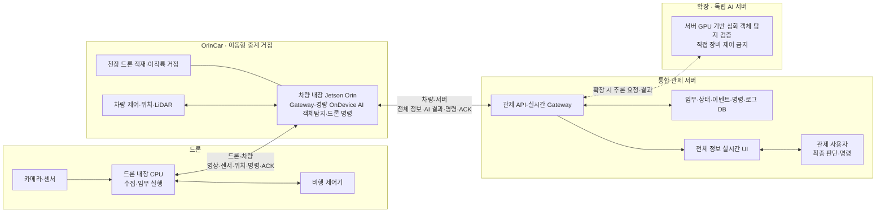

# 산불·조난 대응 드론·OrinCar 통합 관제 시스템 기능 명세서

| 항목 | 내용 |
|---|---|
| 문서 버전 | v0.8 |
| 작성일 | 2026-07-15 |
| 문서 상태 | 초안(Baseline 후보) |
| 대상 시스템 | 드론 내장 CPU·Jetson Orin 탑재 차량·GPU 관제 서버 통합 시스템 |
| 작성 관점 | System Integrator(SI): 요구사항, 구조, 연동, 검증, 운영 이관 관점 |

## 1. 문서 목적

이 문서는 드론과 지상 차량을 이용하여 산불 및 조난 상황을 탐지하고, 차량의 Jetson Orin이 현장 AI 판단과 드론 명령을 수행하며, GPU 관제 서버에서 사용자가 모든 정보를 실시간으로 확인하고 최종 판단하는 통합 시스템의 기능 범위와 담당 업무를 정의한다.

시스템 통신은 `드론 ↔ 차량`, `차량 ↔ 관제 서버`의 두 구간으로 제한한다. 드론은 관제 서버와 직접 통신하지 않으며, 사용자가 내린 드론 명령은 반드시 `관제 서버 → 차량 Jetson Orin → 드론 내장 CPU` 순서로 전달된다.

SI는 개별 기능 개발뿐 아니라 요구사항 분석, 시스템 구조 설계, 시스템 간 데이터 흐름과 책임 경계 정의, 개발·연동 조율, 통합 테스트, 배포 및 운영 이관까지 관리한다. 이 관점은 [이랜서의 SI 역할 설명](https://www.elancer.co.kr/blog/detail/1037)을 참고하였다.

## 2. 프로젝트 목표

1. 차량과 차량 천장에 적재된 드론이 평시에 이동·정찰하며 산불·연기·조난자 등 이상 징후를 탐색한다.
2. 드론 내장 CPU가 카메라·센서 수집, 비행 제어기 연동과 임무 실행을 담당하고 차량하고만 통신한다.
3. 차량에 내장된 Jetson Orin이 이동형 중계 거점의 Gateway이자 엣지 AI로서 현장 정보를 판단하고 사전 승인된 범위에서 드론에 명령한다.
4. 차량은 드론 원본 정보·Orin AI 결과·차량과 드론 상태를 GPU 관제 서버로 전송한다.
5. 관제 사용자는 지도·영상·AI 결과·경보·장비·임무·명령 결과 등 모든 정보를 실시간으로 확인하고 최종 판단한다.
6. 사용자가 추가 명령을 내리면 `관제 서버 → 차량 → 드론` 순서로 전달하고 수행 결과를 역순으로 추적한다.
7. 신고 접수 시 신고 위치에 가장 가까운 가용 차량을 선택 또는 추천하고, 해당 차량이 탑재 드론을 신고 위치로 보내 탐색한다.
8. 다중 관제는 2순위이며, 구현 시 복수 차량·드론 쌍은 mock data로 검증한다.
9. 산불 확산 예측·최적 경로·배터리·충전·원격 의사소통은 핵심 탐지·관제 흐름 이후 단계적으로 확장한다.

## 3. 범위와 전제

### 3.1 구축 범위

| 구분 | 구축 범위 |
|---|---|
| 드론 | 내장 CPU, 비행 제어기, 카메라와 가용 센서로 구성하며 차량과만 통신 |
| 차량 | Jetson Orin을 내장한 OrinCar, 차량 제어·LiDAR, 천장 드론 적재·운반·이착륙 거점, 드론-서버 중계 Gateway |
| 관제 서버 | GPU 장비(학습용), 임무·장비·이벤트·사용자·명령·로그 관리, 실시간 정보 수집·저장·배포; MVP에서는 서버 측 AI 추론을 수행하지 않음 |
| 관제 화면 | 모든 차량·드론 위치와 상태, 영상, Orin AI 결과, 경보, 임무 진행률, 사용자 명령과 ACK 상시 표시; 독립 AI 서버 확장 후 해당 결과 추가 |
| AI | MVP는 차량 Jetson Orin의 산불·연기·조난자 현장 탐지와 제한된 로컬 명령만 사용하며, 서버 측 AI는 독립 AI 서버 확장 이후 적용 |
| 다중 관제 | 2순위 범위이며 복수 차량·드론 쌍의 텔레메트리·이벤트·영상 참조를 mock data로 생성하여 검증 |
| 통합 | 드론-차량 인터페이스와 차량-서버 인터페이스, 두 구간의 명령·ACK·상태 연결 규칙 |

### 3.2 인력 구성

| 역할 | 담당자 | 기본 책임 |
|---|---|---|
| Embedded | 윤주한 | 드론 내장 CPU·비행 제어기·센서, 차량 내장 Jetson Orin·OrinCar·적재 거점 제어, 드론-차량 통신, 차량-서버 현장 연동, 안전 정지 |
| Backend | 변준성 | GPU 메인 관제 서버, API·DB·실시간 메시지·임무·장비·명령·ACK·인증·로그, 최근접 차량 선정·경로·스케줄링 등 서버 알고리즘 개발 |
| Platform | 전우석 | 관제 플랫폼·대시보드, 지도·영상·장비·임무·AI 결과·경보·사용자 판단·명령·ACK의 실시간 UI/UX 개발 |
| AI | 장민규 | MVP Orin 엣지 모델의 데이터셋·학습·평가·추론, 산불·연기·조난자 탐지와 판단 근거·성능 관리; 확장 시 독립 AI 서버 모델 |
| SI 및 QA | 박연수 | 요구사항·아키텍처·인터페이스·일정·리스크·형상 관리, 통합·인수 테스트, 필요 시 팀원 개발 지원(현재 산불 확산 예측 AI 개발 지원 예정) |

2순위 다중 관제의 mock data·시나리오는 별도 전담 역할을 두지 않는다. Backend가 mock 생성기와 공통 메시지를 주관하고, Platform은 다중 관제 표시·조작, AI는 탐지 결과·모델 입력 mock, Embedded는 실장비 제약을 제공하며 SI 및 QA가 통합 검증을 조율한다.

### 3.3 우선순위

| 구분 | 의미 |
|---|---|
| Must | MVP 시연과 핵심 업무 흐름에 반드시 필요 |
| Should | 핵심 기능을 안정화하거나 운영성을 높이기 위해 필요 |
| Could | 시간과 자원이 허용될 때 확장 |

### 3.4 주요 전제

- MVP 실제 장비는 드론 1대와 Jetson Orin 탑재 차량 1대의 1:1 페어를 기준으로 한다.
- 다중 관제는 2순위이며 복수 차량·드론 쌍은 mock data로 검증한다. 3D 시뮬레이터는 필요 시 mock 공급원으로 확장한다.
- Jetson Orin은 차량 내부에 탑재되고 드론은 차량 천장에 적재·운반된다. 적재 고정, 이착륙, 회수와 충전 방식은 상세 기구 설계에서 확정한다.
- 드론은 차량과만 통신하며 관제 서버에 직접 연결하지 않는다. 관제 서버는 차량의 Jetson Orin만 현장 Gateway로 식별한다.
- Orin 엣지 AI는 재촬영·접근·대기 등 사전 승인된 안전 범위에서 드론에 자동 명령할 수 있다. 고위험 임무 변경은 안전 정책과 관제 사용자 판단을 적용한다.
- 관제 사용자는 전체 현황을 실시간으로 확인하고 최종 명령 권한을 갖는다. 사용자 명령은 `관제 서버 → 차량 → 드론` 경로를 따른다.
- 지도, 기상, 수목, 등산로 데이터의 실제 공급원과 라이선스는 상세 설계 전에 확정하나, 필요 시 관계자 회의를 거쳐 수정 가능하다.
- 드론-차량과 차량-서버의 물리 프로토콜은 상세 설계에서 확정하되, 기능 명세상 공통 메시지와 두 구간 라우팅 구조는 유지한다.
- AI 성능 합격 기준은 확보된 검증 데이터셋을 기준으로 Precision, Recall, 오탐률과 추론 지연 목표를 별도 기준선으로 승인한다.

### 3.5 확장 방안

MVP의 AI 판단은 차량 Jetson Orin에서만 수행하며 관제 서버 내부에는 AI 분석 서비스를 두지 않는다. MVP 이후 정확도 향상을 위한 확장 단계에서 관제 시스템에 독립 GPU AI 서버를 새로 추가한다.

| 확장 항목 | 방안 |
|---|---|
| 관제 시스템 AI 서버 | 관제 Backend와 분리된 GPU AI 서버를 추가하고 산불·연기·조난자 재검증, 산불 확산 예측, 경로 분석과 모델 서빙을 담당시킨다. |
| 데이터 흐름 | 차량 Jetson Orin의 원본·요약 데이터가 관제 서버에 먼저 수집된 뒤, 관제 Backend가 필요한 영상·센서·이벤트를 AI 서버에 요청하고 결과를 다시 수신한다. |
| 제어 경계 | AI 서버는 판단 결과·신뢰도·근거·후보 행동만 반환하며 차량·드론에 직접 명령하지 않는다. 최종 명령은 기존과 같이 `관제 사용자 → 관제 서버 → 차량 → 드론` 경로를 따른다. |
| 확장·운영 | 추론 API 또는 메시지 큐, 모델 버전·배포·GPU 자원·작업 큐·timeout·재시도·모니터링을 분리하고 필요 시 AI 서버를 수평 확장한다. |
| 장애 대응 | AI 서버 장애·지연 시 Orin 엣지 AI 결과와 원본 정보 표시를 유지하고, 관제 Backend가 timeout·재시도·보수적 fallback을 적용한다. |

Backend는 AI 서버 연동 API·작업 큐·결과 저장을, AI는 모델 서빙·GPU 추론을, Platform은 AI 서버 상태·결과·지연 표시를 담당한다. SI 및 QA는 관제 서버와 AI 서버의 책임 경계, 장애 격리와 계약·부하·복구 시험을 관리한다.

## 4. 시스템 구성과 데이터 흐름

### 4.1 표준 업무 흐름

1. 평시에는 차량과 차량에 적재된 드론이 순찰하며 탐지 임무를 수행한다.
2. 드론 내장 CPU가 영상·센서·위치·배터리·비행 상태를 수집하여 차량의 Jetson Orin으로 보낸다.
3. Jetson Orin이 산불·연기·조난자 후보를 감지하고, 사전 승인 범위에서는 재촬영·접근·대기 등 드론 명령을 즉시 내린다.
4. 차량은 드론 원본 정보, Orin AI 결과, 차량·드론 상태와 명령 결과를 GPU 관제 서버로 전송한다.
5. 관제 서버는 모든 정보를 수집·저장·배포하고 관제 화면에 상시 실시간으로 표시한다. MVP의 AI 결과는 차량 Jetson Orin에서 생성된다.
6. 신고가 접수되면 관제 서버가 신고 위치와 가장 가까운 가용 차량을 선택 또는 추천한다.
7. 관제 사용자가 탐색 임무를 발행하면 관제 서버가 해당 차량에 명령하고, 차량의 Orin이 탑재 드론을 신고 위치로 출동시킨다.
8. 탐지 결과를 받은 사용자가 최종 판단에 따라 추가 명령을 내리면 `관제 서버 → 차량 → 드론` 순으로 전달한다.
9. 장비가 수행 결과를 `드론 → 차량 → 관제 서버` 순으로 회신하고, 장애물·통신 단절·배터리 부족 시 현장 안전 정책을 우선 수행한다.
10. 임무 종료 후 모든 명령, 상태, AI 결과와 사용자 판단을 보관하고 재생·보고한다.

### 4.2 통신·판단 책임 경계

| 구간·주체 | 책임 | 금지·제한 |
|---|---|---|
| 드론 내장 CPU | 센서 수집, 비행 상태·ACK 회신, 차량 명령 실행, 기체 안전 동작 | 관제 서버 직접 연결·직접 명령 수신 금지 |
| 차량 Jetson Orin | 드론 페어링, 엣지 AI 판단, 제한된 로컬 명령, 전체 정보 집계, 서버 명령 검증·중계 | 사전 승인 범위를 벗어난 고위험 자율 명령 제한 |
| GPU 관제 서버 | 전체 정보 수집·저장·실시간 배포, 임무·권한·감사와 사용자 명령 발행 | MVP 서버 측 AI 추론과 드론 통신 구간을 우회한 직접 제어 금지 |
| 관제 사용자 | 모든 정보 확인, AI 결과 검토, 최종 판단, 임무 변경·중지·복귀·재탐색 명령 | 권한·안전 정책을 벗어난 명령 금지 |

## 5. 공통 데이터 및 상태 규칙

### 5.1 공통 식별자

- `device_id`: 실제·mock 장비를 구분하는 고유 ID
- `gateway_id`: 관제 서버와 연결되는 차량 Jetson Orin 고유 ID
- `vehicle_id`: 이동형 거점 차량 고유 ID
- `drone_id`: 차량에 페어링된 드론 고유 ID
- `mission_id`: 순찰·조난·화재 대응 임무 고유 ID
- `event_id`: 탐지·경보·장애 이벤트 고유 ID
- `command_id`: 이동·복귀·정지 등 명령 고유 ID
- `timestamp`: 서버 기준 시각과 장비 발생 시각을 함께 기록
- `location`: 위도·경도·고도 또는 명시된 mock 좌표계
- `parent_command_id`: 서버 명령과 Orin이 변환·중계한 드론 명령을 연결하는 상위 명령 ID
- `issuer`: `edge_ai`, `operator`, `safety_policy` 중 하나
- `source`: `real`, `mock`, `replay` 중 하나

### 5.2 임무 상태

`CREATED → ASSIGNED → DISPATCHED → IN_PROGRESS → COMPLETED`

예외 상태는 `PAUSED`, `RETURNING`, `FAILED`, `CANCELLED`로 관리한다. 상태 전환에는 수행 주체, 시각, 사유를 기록한다.

| 구분 | 상태 | 의미 |
|---|---|---|
| 정상 | `CREATED` | 임무가 생성되었으며 아직 수행 장비가 배정되지 않은 상태 |
| 정상 | `ASSIGNED` | 임무를 수행할 차량 또는 드론이 배정되어 출동을 준비하는 상태 |
| 정상 | `DISPATCHED` | 대상 장비에 출동 명령이 전달되어 임무 시작을 대기하는 상태 |
| 정상 | `IN_PROGRESS` | 대상 장비가 임무 수행을 시작하여 현장에서 작업 중인 상태 |
| 정상 | `COMPLETED` | 계획된 임무를 정상적으로 완료하고 결과가 기록된 상태 |
| 예외 | `PAUSED` | 사용자 명령이나 현장 조건으로 임무가 일시 중지되었으며 재개할 수 있는 상태 |
| 예외 | `RETURNING` | 임무 수행을 중단하거나 종료하고 장비가 지정된 복귀 지점으로 이동 중인 상태 |
| 예외 | `FAILED` | 장비 장애, 통신 오류 또는 수행 조건 미충족으로 임무를 완료하지 못한 상태 |
| 예외 | `CANCELLED` | 사용자 또는 시스템 정책에 의해 임무가 취소되어 더 이상 수행하지 않는 상태 |

### 5.3 명령 처리 원칙

- 모든 이동 명령에는 `command_id`, 대상 장비, 발행 시각, 만료 시각, 목표 좌표 또는 동작, 발행자를 포함한다.
- 서버가 발행한 드론 대상 명령은 차량의 Jetson Orin이 수신하여 송신자 인증, 메시지 무결성, 권한, 유효시간과 안전 범위를 검증한 뒤 드론 명령으로 변환한다.
- Orin이 변환한 드론 명령은 `parent_command_id`로 서버 원본 명령과 연결한다.
- 드론과 차량은 각 구간의 명령 수신·수행 결과를 `ACK`, `RUNNING`, `SUCCEEDED`, `FAILED`, `EXPIRED` 중 하나로 회신한다.
- 중복 `command_id`는 재실행하지 않는다.
- 현장 비상 정지·충돌 회피·저전력 복귀·착륙 명령은 일반 명령보다 우선한다.

### 5.4 보안 신뢰 경계와 기본 원칙

| 신뢰 경계 | 보호 대상 | 기본 원칙 |
|---|---|---|
| 현장 장비·엣지 | 드론·차량 제어권, 센서, 장비 키, 펌웨어·AI 모델 | 장비별 신원, 최소 서비스, 안전 정지, 승인 아티팩트만 실행 |
| 드론↔차량 통신 | 드론 제어 명령, 텔레메트리, 영상, 위치, ACK | 페어링 장비 인증, 채널 보호, 변조·재전송·만료 검증, 단절 시 기체 fail-safe |
| 차량↔관제 통신 | 전체 현장 정보, Orin AI 결과, 사용자 명령, 통합 ACK | Gateway 인증, 채널별 암호화 또는 서명, 명령 추적, 단절 시 제한된 로컬 운용 |
| 관제 API·웹 | 사용자 세션, 임무·명령 API, 관리자 권한 | API별 서버 측 권한, 입력 검증, CSRF·XSS 방어, 호출 제한·감사 |
| 데이터 저장소 | 원본 영상, 얼굴·위치·조난 정보, 로그, 모델·학습 데이터 | 최소 수집, 비식별화, 접근 분리, 보관기간·삭제·반출 추적 |
| AI 판단 경계 | MVP Orin 엣지 탐지·로컬 명령, 확장 독립 AI 서버의 분석 결과·제어 후보 | 불확실성·입력 품질 검증, 자동 명령 허용 범위, 사용자 최종 권한, 비상 정지 우선 |
| AI 개발 에이전트 | 소스코드, 개발 도구, 테스트·배포 권한 | 최소 권한, 샌드박스, 결정적 검증 게이트, 사람 리뷰·감사 |

내부 네트워크, mock data, AI 결과도 자동으로 신뢰하지 않는다. 각 경계를 통과할 때 신원·권한·형식·무결성·안전 범위를 검증하고 실패 시 안전한 기본값으로 처리한다.

## 6. 기능 목록 및 인수 기준

| ID | 기능 | 우선순위 | 주요 입력 | 주요 출력 | 인수 기준 |
|---|---|---:|---|---|---|
| COM-001 | 장비·Gateway 등록 및 상태 확인 | Must | `gateway_id`, 차량·드론 ID, 페어링, 센서, 접속 정보 | 차량-드론 페어, 온라인·오프라인·오류 상태 | 실제 차량·드론 페어와 mock 페어가 구분되어 표시되고, 각 통신 구간의 heartbeat 제한 초과 시 단절 구간이 식별된다. |
| COM-002 | 공통 시각·좌표·메시지 규격 | Must | 장비별 시각·좌표·원시 메시지 | 표준 시각·좌표·메시지 | 실제·mock 데이터에 동일 필드가 적용되고, 좌표계와 단위가 문서화되며, 잘못된 메시지가 거부·기록된다. |
| COM-003 | 드론-차량-서버 2구간 라우팅 | Must | 드론 데이터, 서버·Orin 명령, 구간별 ACK | 연결된 데이터·명령·ACK | 드론은 서버와 직접 통신하지 않고, 서버의 드론 명령과 결과가 `parent_command_id`로 차량 중계 명령과 끝까지 연결된다. |
| DRN-001 | 드론 내장 CPU 기반 임무 실행 | Must | 카메라·센서, 비행 상태, 차량 명령 | 영상·센서·위치·ACK, 비행 동작 | 드론 내장 CPU가 데이터를 수집하고 차량 명령을 비행 제어기에 전달하며, 서버 직접 연결 없이 차량에만 상태와 결과를 회신한다. |
| MIS-001 | 정기 순찰 임무 생성 | Must | 순찰 구역, 경유점, 시간, 대상 차량·드론 페어 | 순찰 임무와 경로 | 사용자가 구역과 시간을 지정해 임무를 생성하면 차량 Orin이 드론에 전달하고 구간별 수신 여부가 회신된다. |
| MIS-002 | 신고 접수 및 최근접 차량 긴급 출동 | Must | 신고 위치, 내용, 차량·드론 위치와 가용 상태 | 추천 차량, 탐색 임무, 출동 명령 | 거리·통신·배터리·드론 탑재 상태를 기준으로 가용 차량이 추천되고, 사용자 명령 후 해당 차량이 드론을 신고 위치로 출동시킨다. |
| MIS-003 | 임무 명령 및 생명주기 관리 | Must | 임무 생성·중지·복귀·취소 명령 | 상태 전환, 구간별 명령 결과 | 허용된 상태 전환만 수행되고 서버 명령, Orin 중계 명령, 드론 결과와 실패 사유가 하나의 이력으로 저장된다. |
| OBS-001 | 위치·고도·속도·센서 텔레메트리 수집 | Must | 드론·차량 텔레메트리 | 최신 상태, 시계열 기록 | Orin이 차량·드론 정보를 집계해 서버로 보내고, 관제 화면에 최신 값과 누락·지연·단절 구간이 실시간 표시된다. |
| OBS-002 | 영상·이미지 수집 및 스트리밍 | Must | 드론 카메라 프레임, 촬영 메타데이터 | 실시간 영상, 스냅샷, 영상 참조 | 드론 영상이 차량을 거쳐 서버에 전달되고, 관제 화면에서 프레임과 차량·드론 ID·촬영 위치·시각이 함께 표시된다. |
| AI-001 | Orin 산불·연기 탐지 | Must | 드론 이미지·영상 프레임 | 종류, 신뢰도, 경계 상자, 위치 | 차량 Jetson Orin에서 합의한 지연·성능 기준으로 탐지하고 결과·모델 버전·근거 프레임을 서버에 전송한다. |
| AI-002 | Orin 조난자·이상 징후 탐지 | Must | 드론 이미지·영상 프레임 | 조난자 후보, 신뢰도, 위치, 근거 이미지 | 차량 Jetson Orin이 조난자 후보를 감지하고 관제 사용자가 원본 프레임과 탐지 위치를 실시간 확인할 수 있다. |
| AI-003 | 탐지 경보 및 사용자 최종 판단 | Must | Orin AI 결과, 확장 AI 서버 결과(도입 시), 원본 영상, 전체 장비 상태 | 승인·오탐·보류 판정, 추가 명령, 사건 상태 | 사용자가 모든 정보를 확인해 최종 판정·명령할 수 있고 판정자·시각·근거와 `서버→차량→드론` 수행 결과가 저장된다. |
| AI-004 | 산불 확산 예측(독립 AI 서버 확장) | Could | 발화 위치, 기상, 지형, 수목 정보, 경과 시간 | 시간대별 예상 확산 영역과 위험도 | 독립 AI 서버 도입 후 입력 조건과 모델 버전이 기록되고, 지도에서 시간대별 결과를 조회하며 데이터 부족 시 불확실성을 표시한다. |
| AI-005 | 드론·차량 경로 계획(Backend 알고리즘) | Should | 출발·목표 위치, 지형·등산로, 위험 구역, 장비 제약 | 경유점, 거리, 예상 시간, 대체 경로 | Backend의 결정적 경로 알고리즘이 통행 불가·위험 구역을 회피하고 경로 실패 이유와 대체안을 제공한다. 확장 AI 서버 결과는 선택적 위험도 입력으로만 사용한다. |
| AI-006 | AI 입력 신뢰성·강건성 검증 | Must | 영상·센서·GPS, 입력 품질, 모델 신뢰도 | 정상·의심·거부 판정, 대체 동작, 경보 | 범위 밖 값, 누락·불일치 센서, 낮은 신뢰도 또는 의심 입력이 제어 명령으로 바로 이어지지 않고 보수적 대체 동작과 경보로 전환된다. |
| AI-007 | Orin 엣지 판단과 로컬 드론 명령 | Must | AI 결과, 임무 상태, 안전 정책, 드론 상태 | 재촬영·접근·대기 등 드론 명령, 판단 근거 | 사전 승인된 명령만 Orin이 직접 발행하며 `issuer=edge_ai`와 근거를 서버에 보고하고, 범위 밖 명령은 사용자 판단 대상으로 전환한다. |
| VEH-001 | OrinCar 임무 경로 주행 | Must | 승인 경로, 속도 제한, 정지 조건 | 차량 위치·속도·진행 상태 | 경로를 순서대로 수행하고 완료·실패를 회신하며 통신 단절 또는 위험 시 정지한다. |
| VEH-002 | OrinCar 자율주행 제어 | Must | 승인 경로, 차량 위치, 카메라·LiDAR 등 주행 센서 정보, 속도·안전 제한 | 자율 조향·속도 제어, 차량 위치·주행 상태, 정지·재계획 요청 | OrinCar가 수동 조향 명령 없이 승인 경로를 자율 주행하며, 경로 이탈·위치 신뢰도 저하·위험 감지 시 감속 또는 정지하고 원인을 관제 서버에 전송한다. |
| VEH-003 | LiDAR 기반 장애물 감지·비상 정지 | Must | 거리·각도 데이터, 정지 거리 | 장애물 경보, 감속·정지 상태 | 설정된 위험 영역에서 장애물을 감지하면 주행 명령보다 우선해 정지하고 관제에 원인을 전송한다. |
| VEH-004 | 이동형 중계 거점과 드론 적재·페어링 | Must | 차량·드론 페어링, 적재·이착륙·회수 상태 | 탑재 상태, 출동 가능 상태, 안전 경보 | 차량 천장에 드론을 안전하게 적재·운반하고, 서버는 차량별 탑재 드론과 출동 가능 여부를 식별한다. |
| SRV-001 | 통합 관제 서버 실시간 운영 | Must | 차량이 전송한 전체 정보, Orin AI 결과, 명령·ACK | 실시간 화면, 저장 이력, 명령·ACK | 모든 차량·드론 정보가 관제 화면에 상시 갱신되고, 서버가 MVP에서 AI 추론 없이 수집·저장·배포·명령 기능을 수행한다. |
| SRV-002 | 관제 시스템 독립 AI 서버 연동 | Could | 관제 서버의 영상·센서·이벤트·추론 요청 | AI 결과·신뢰도·근거·모델 버전·작업 상태 | 관제 Backend가 독립 GPU AI 서버에 추론을 요청하고 결과를 저장·표시하며, AI 서버 장애 시 현장 정보 수집·화면·명령 경로가 유지되고 장비 직접 제어가 차단된다. |
| SIM-001 | 다중 관제 mock data 생성 | Should | 복수 차량·드론 페어 설정, 상태·이벤트 시나리오 | 재현 가능한 mock 메시지·영상 참조 | 고정 seed와 설정으로 복수 페어의 위치·상태·탐지·장애 데이터를 생성한다. |
| SIM-002 | 복수 차량·드론 페어 mock 운용 | Should | mock 페어, 임무, 통신·배터리 제약 | 독립 텔레메트리와 임무 결과 | 2순위 범위에서 여러 페어가 독립 임무를 수행하고 관제 화면에서 상태·영상·경보·명령이 섞이지 않는다. |
| SIM-003 | 실물·mock 공통 관제 인터페이스 | Should | 실제·mock 장비 메시지 | 통합 장비·임무·이벤트 모델 | 관제 기능 변경 없이 `source`만 구분하여 실제 페어와 mock 페어를 조회·명령할 수 있다. |
| OPS-001 | 드론 배터리 감시 및 복귀 판단 | Must | 배터리 잔량, 소비율, 위치, 임무 경로 | 잔여 시간, 경보, 복귀·교대 권고 | 안전 복귀에 필요한 임계치 전에 경보가 발생하고 사용자 승인 또는 안전 정책에 따라 복귀한다. |
| OPS-002 | 충전소 위치·배정 최적화 | Should | 임무 분포, 이동 거리, 충전 시간, 충전소 후보 | 추천 위치, 배정 순서, 대기 시간 | 비교 가능한 평가 지표와 함께 추천안을 출력하고 여러 드론의 충전 충돌을 방지한다. |
| OPS-003 | 조난자 원격 의사소통 | Could | 음성 또는 텍스트, 조명, 연결 상태 | 양방향 메시지, 통화 상태 | 관제와 현장 단말 사이에 연결·종료 상태가 표시되고 실패 시 재시도 또는 대체 수단을 안내한다. |
| OPS-004 | 실시간 통합 관제 대시보드 | Must | 지도, 전체 장비, 임무, 영상, Orin AI, 확장 AI 서버 결과, 경보, 명령·ACK | 통합 상황 화면과 제어 UI | 한 화면에서 모든 현장 정보를 상시 확인하고, 권한 내 명령을 실행하여 차량 중계와 드론 수행 상태까지 추적할 수 있다. |
| OPS-005 | 로그·재생·보고서 | Should | 명령, 상태, 영상 참조, AI 결과, 사용자 조작 | 검색 로그, 타임라인 재생, 임무 보고서 | `mission_id`와 시간 범위로 전체 흐름을 재구성하고 주요 결과를 내보낼 수 있다. |
| SAF-001 | 장애·구간별 통신 단절·안전 복구 | Must | 드론-차량 또는 차량-서버 heartbeat 누락, 센서 오류, 명령 실패 | 경보, 안전 정지·대기·복귀·착륙, 복구 상태 | 단절 구간별 안전 동작이 실행되고, 차량의 제한된 로컬 운용과 재연결 후 상태·이벤트 재동기화 결과가 기록된다. |
| SAF-002 | AI 판단 안전 게이트·사람 승인 | Must | AI 제안, 장비 상태, 지오펜스, 배터리, 위험 정책 | 승인·거부·수정된 안전 명령, 판정 사유 | 고위험 이동·복귀·임무 변경은 안전 범위 검사와 권한 있는 사람의 승인을 통과해야 하며 비상 정지가 항상 우선한다. |
| SEC-001 | 관제 사용자 인증·권한·세션 관리 | Must | 사용자 계정, 역할, 세션, 조작 요청 | 접근 허용·거부, 세션 상태, 감사 로그 | 조회·판단·조작·관리 권한이 API마다 서버 측에서 구분되고 모든 제어 조작의 사용자와 결과를 추적할 수 있다. |
| SEC-002 | 구간별 장비 식별·상호 인증·채널 보호 | Must | Gateway·차량·드론 ID, 페어링, 인증서·키, 통신 프로토콜 | 인증된 연결, 암호화·서명 상태 | 미등록 Gateway와 잘못 페어링된 드론의 연결·명령을 거부하고 드론-차량·차량-서버의 제어·영상 채널을 각각 보호한다. |
| SEC-003 | 중계 명령 무결성·재전송 방지 | Must | 서명된 명령, `command_id`, `parent_command_id`, 발행·만료 시각 | 구간별 실행·거부·만료 결과, 보안 로그 | 서버·차량·드론에서 변조·만료·중복·권한 없는 명령을 거부하고 원본 서버 명령부터 드론 결과까지 감사할 수 있다. |
| SEC-004 | 비밀정보·소프트웨어·모델 무결성 | Must | API 키·장비 키, 펌웨어·서비스·모델 파일, 버전·해시·서명 | 안전한 로드·배포·교체, 무결성 경보 | 비밀정보가 소스코드에 저장되지 않고, 승인되지 않거나 무결성 검증에 실패한 펌웨어·모델·설정은 배포·실행되지 않는다. |
| SEC-005 | 영상·위치 개인정보 보호 | Must | 촬영 영상, 얼굴·차량번호, 위치·조난 정보, 접근 요청 | 최소 수집 데이터, 비식별본, 보관·삭제·접근 이력 | 수집 목적·보관기간·접근 권한이 정의되고 민감 영상은 필요한 시점에 마스킹되며 조회·반출·삭제 이력을 추적할 수 있다. |
| SEC-006 | 보안 이벤트 감시·호출 제한 | Must | 인증 실패, 잘못된 메시지, 과도한 API 호출, 장비 연결 이벤트 | 차단·제한, 경보, 감사 로그 | 반복 로그인 실패·비정상 호출·잘못된 제어 메시지를 탐지해 제한하고, 정상적인 비상 정지와 필수 텔레메트리는 보호한다. |
| HNS-001 | AI 개발 에이전트 규칙·최소 권한 | Must | 기능 ID, 저장소 규칙, 허용 도구·경로·명령 | 허용·차단된 작업, 작업 계획 | 에이전트가 저장소의 명시된 범위에서만 작업하고 실제 장비·운영 데이터·비밀정보·배포 작업에는 사람의 명시적 승인 없이 접근하지 않는다. |
| HNS-002 | 샌드박스·자동 검증 게이트 | Must | 에이전트 변경 코드, 설정, 테스트 | 문법·정적 분석·단위·계약 테스트 결과 | 에이전트 변경은 격리 환경에서 수행되고 필수 검증이 실패하면 완료·병합 상태로 전환되지 않는다. |
| HNS-003 | 사람 리뷰·에이전트 감사·규칙 개선 | Must | 에이전트 계획·도구 호출·변경 diff·검증 결과 | 승인·반려, 감사 이력, 갱신된 규칙 | 모든 AI 생성 변경은 담당자의 리뷰 후 반영되고 실패·차단 원인이 기록되어 재발 방지 규칙이나 테스트로 환류된다. |

## 7. 기능별 인력 업무 배정

아래 표의 업무는 각 기능을 완료하기 위해 담당자가 수행해야 하는 최소 작업이다. 이름은 3.2절의 인력 구성과 동일하며, 모든 담당자는 관련 인터페이스 확인과 통합 테스트에 참여한다.

### 7.1 공통·임무 기능

| 기능 ID | Embedded 윤주한 | Backend 변준성 | Platform 전우석 | AI 장민규 | SI 및 QA 박연수 |
|---|---|---|---|---|---|
| COM-001 | 차량 Gateway·드론 ID, 페어링과 구간별 heartbeat 송신 구현 | Gateway·차량·드론 레지스트리, 상태 API·DB, 복수 mock 페어·heartbeat 생성 | 차량·드론 페어와 구간별 온라인·오류 상태 화면 | Orin 모델 가용 상태·버전 제공; 확장 시 독립 AI 서버 상태 추가 | 장비 분류·페어링·상태·책임 경계 확정, 등록·단절 시험 |
| COM-002 | 센서 단위, 장비 시각, 실제 좌표 변환 구현 | 공통 스키마 검증, 수신 거부·오류 로그, 실장비와 동일한 mock 메시지 생성 | 표준 좌표·시각·단위 표시와 오류 상태 시각화 | AI 입출력 스키마와 좌표·신뢰도 규격 준수 | 메시지 명세·버전 정책·샘플 페이로드 관리, 호환성 시험 |
| COM-003 | 드론-차량 송수신과 Orin 중계·`parent_command_id` 연결 구현 | 차량만 Gateway로 허용하고 명령·ACK 상관관계 저장, 지연·단절·중복 mock 제공 | 서버 명령→차량 중계→드론 결과의 단계별 상태 표시 | `issuer`와 판단 근거를 명령에 제공 | 서버 직접 드론 연결 차단, 정상·실패·재전송 E2E 시험 |
| DRN-001 | 내장 CPU 센서 수집·비행 제어기 연동·차량 전용 통신·fail-safe 구현 | 차량이 집계한 드론 상태·ACK 저장 API와 드론 상태 mock 제공 | 드론 위치·센서·배터리·비행·ACK 화면 | 입력 해상도·주기·전처리 조건 정의 | 서버 직접 연결 없음과 차량 명령 수행·안전 동작 인수 시험 |
| MIS-001 | 차량 Orin의 임무 수신·드론 중계와 드론 경유점 수행 구현 | 순찰 임무 API·스케줄러, 차량-드론 페어와 순찰 경로 mock 구현 | 순찰 구역·시간·대상 페어 설정과 구간별 ACK UI | 위험도 기반 순찰 우선 구역 추천 | 정상·취소·지연·중복 임무와 2구간 ACK 시험 |
| MIS-002 | 차량·드론 위치·가용성 송신, Orin의 이륙·탐색·복귀 명령 구현 | 신고 접수 API, 최근접 가용 차량 선정 알고리즘, 긴급 출동 mock·상태 추적 | 신고 위치·추천 차량·사용자 승인·출동 진행 화면 | 신고 정보와 관측 결과 기반 탐색 구역 추천 | 차량 선정 기준·사용자 판단 지점·예외 책임 확정 및 E2E 시험 |
| MIS-003 | PAUSE·RETURN·CANCEL 중계, 구간별 동작과 결과 회신 | 임무 상태 머신, 서버·중계 명령 이력, 재시도·만료와 실패 mock 처리 | 임무 생명주기 제어, 명령 이력·실패 사유 UI | AI 작업의 요청·처리·실패 상태 연동 | 상태 전이와 원본-중계 명령 추적, 복구·동시성 시험 |

### 7.2 관측·AI 기능

| 기능 ID | Embedded 윤주한 | Backend 변준성 | Platform 전우석 | AI 장민규 | SI 및 QA 박연수 |
|---|---|---|---|---|---|
| OBS-001 | 드론 CPU 수집 후 Orin이 차량·드론 텔레메트리 집계·송신 | 전체 정보 실시간 수신, 최신 상태 캐시·시계열 DB, 오류·지연·단절 mock 생성 | 지도·장비 카드·시계열·단절 구간 실시간 표시 | 모델 입력에 필요한 센서 전처리 조건 정의 | 구간별 주기·단위·허용 지연·누락 정책과 데이터 품질 시험 |
| OBS-002 | 드론 카메라 캡처·인코딩, Orin 영상 중계와 메타데이터 결합 | 차량 경유 스트림 수신·중계, 스냅샷·영상 참조 저장, mock 영상 참조 제공 | 장비별 영상 선택, 촬영 위치·시각·AI 결과 오버레이 | Orin 추론 전처리 구현; 확장 시 독립 AI 서버 입력 전처리 추가 | 두 구간 대역폭·지연·화질과 스트림 단절·복구 시험 |
| AI-001 | 차량 Jetson Orin 추론 환경, 드론 영상 입력, 결과·근거 송신 최적화 | Orin 탐지 결과 API·저장·실시간 이벤트, 연기·불꽃 조건 mock 제공 | 실시간 경보·원본 프레임·위치·모델 버전 표시 | Orin용 데이터 수집·라벨링·경량 모델 학습·평가·배포 | 엣지 지연·성능·오탐 기준 승인, Orin 모델 인수 시험 |
| AI-002 | Orin 조난자 추론 입력과 위치 결합, 결과 송신 | 조난 후보 API·이력 저장, 자세·가림·거리 조건 mock 제공 | 조난 후보 경보·위치·근거 영상·최종 판정 UI | Orin용 조난자·이상 징후 모델과 위치 추정 구현 | 개인정보·오탐 리스크, 탐지부터 사용자 판단까지 E2E 시험 |
| AI-003 | 선택된 원본 프레임·전체 장비 상태를 차량 경유로 재전송 | 판정·추가 명령 API와 이력 저장, 동일 사건 반복 mock 제공 | 모든 정보와 승인·오탐·보류·추가 명령·수행 결과 UI | 불확실성·근거·모델 버전 제공, 사용자 피드백 수집 | 사용자 최종 권한과 SLA, 서버→차량→드론 명령 감사 시험 |
| AI-004 | 현장 기상·온습도·연기 센서 데이터 제공 | 예측 서비스 연동·결과 저장, 화재 확산 입력 시나리오 API | 시간대별 확산 영역·위험도 지도 시각화 | 확산 모델, 입력 전처리, 불확실성·위험도 산출 | 데이터 출처·가정·사용 제한과 평가 방법 승인, 결과 재현 시험 |
| AI-005 | 드론·차량 제약과 실시간 장애 정보를 제공·경로 수행 | 최근접 차량·A* 경로·비용 함수·대체 경로 알고리즘, 요청·재계획 API | 후보 경로 비교·승인·배포·실패 사유 UI | 위험도·탐지 결과 등 경로 비용 입력과 모델 연계 지원 | 좌표·제약·승인 절차 확정, 정상·경로 없음·동적 장애 시험 |
| AI-006 | 센서 교차검증용 상태·범위·오류 코드 제공 | 의심 입력·fallback API와 이력, 노이즈·가짜 GPS·불일치 mock 생성 | 입력 품질 경보·거부 사유·대체 동작·복구 상태 UI | 입력 품질·이상치·OOD·신뢰도 판정과 보수적 fallback 구현 | 공격·오류 모델과 합격 기준 정의, 정상·의심·거부·복구 시험 |
| AI-007 | Orin에서 허용 명령·지오펜스·배터리 검사 후 드론 로컬 명령 발행·보고 | `edge_ai` 명령·근거·결과 저장, 허용 범위 안팎 mock과 정책 API | 로컬 명령·판단 근거·수행 결과와 사용자 override UI | 신뢰도·정책 기반 행동 선택과 범위 밖 사용자 판단 전환 | 자동·승인·금지 명령 분류, 로컬 명령·보고·사용자 override 시험 |

### 7.3 차량·서버·Mock 기능

| 기능 ID | Embedded 윤주한 | Backend 변준성 | Platform 전우석 | AI 장민규 | SI 및 QA 박연수 |
|---|---|---|---|---|---|
| VEH-001 | PCA9685 모터·서보 제어, 경로 추종, watchdog·안전 정지 구현 | 차량 명령·ACK·위치·진행 상태 API와 차량 경로 수행 mock | 차량 위치·경로·진행률·정지 상태와 원격 명령 UI | 차량 주행 가능 경로와 재계획 입력 제공 | 명령 만료·속도 제한·안전 책임 정의, 실물 주행 인수 시험 |
| VEH-002 | 위치·카메라·LiDAR 기반 자율 조향·속도 제어와 경로 이탈·센서 이상 시 안전 정지 구현 | 자율주행 상태·경로 이탈·정지 원인 API와 차량 자율주행 mock | 현재 경로·위치·속도·자율주행 상태·정지 원인 표시와 임무 중지·복귀 UI | 차선·주행 가능 영역·객체 인식 결과 제공 | 속도·경로 이탈·정지 기준 확정, 위치 신뢰도 저하·센서 이상·장애물 대응 시험 |
| VEH-003 | LiDAR 파싱, 위험 영역·거리 판정, 모터 차단 구현 | 장애물 경보·정지·해제 상태 API, 정적·이동 장애물 mock | 장애물 경보·거리·정지 원인·수동 해제 UI | 거리 필터 또는 위험도 판정 고도화 지원 | 안전 우선순위·정지 거리 승인, 오탐·미탐·센서 고장 시험 |
| VEH-004 | 천장 적재·고정·이착륙·회수 상태와 차량-드론 페어링 구현 | 차량-드론 페어링·탑재·출동 상태 API와 실패 mock | 차량별 탑재 드론·출동 가능·회수 상태 표시 | 출동 가능 여부를 경로·임무 입력에 반영 | 기구 안전 조건·상태 전이·책임 정의, 적재·출동·회수 인수 시험 |
| SRV-001 | 차량 Gateway가 전체 현장 정보와 ACK를 연속 송신하도록 지원 | 메인 관제 서버의 수집·DB·WebSocket·명령·ACK 통합, 다중 페어 부하 mock | 전체 위치·영상·Orin AI·경보·임무·명령을 실시간 통합한 관제 대시보드 | Orin 결과 인터페이스 제공; 독립 AI 서버 기능은 SRV-002에서만 구현 | 실시간 갱신·장애 격리·데이터 유실·복구 기준과 인수 시험 |
| SRV-002 | AI 서버용 입력·네트워크 조건과 현장 fallback 상태 제공 | 독립 AI 서버 추론 API·작업 큐·결과 저장·timeout·재시도·장애 격리 구현 | AI 서버 상태·모델 버전·작업 지연·결과·fallback 표시 | GPU 모델 서빙·추론·버전·배포·자원 모니터링 구현 | 서버 간 계약·부하·장애·복구 시험과 장비 직접 제어 차단 검증 |
| SIM-001 | 실제 페어의 센서 범위·상태·명령 규격 제공 | 고정 seed 복수 페어의 위치·상태·탐지·장애 mock 생성기와 실행 API | mock 시나리오 선택·실행·상태 표시 | 평가용 AI 입력·정답·결과 mock 형식 정의 | 2순위 범위·시나리오 버전·재현성 기준 관리 |
| SIM-002 | 실제 차량·드론 성능·센서·배터리 제약 제공 | 복수 페어 등록·독립 임무·통신 상태·영상 참조 mock과 부하 생성 | 다중 페어 위치·상태·AI 결과·경보·명령 분리 표시 | 페어별 탐지 결과 mock 또는 모델 연결 | 목표 페어 수·동시성·데이터 분리·부하 시험 |
| SIM-003 | 실제 장비 어댑터가 공통 명세를 준수하도록 구현 | 실물·mock 공통 API·저장 구조와 `source` 라우팅 | 동일 UI에서 `source` 필터와 실물·mock 전환 지원 | 실제·mock 전처리 차이를 설정으로 분리 | 공통 인터페이스와 대체 시험 전략, 실물↔mock 전환 시험 |

### 7.4 운영·안전·보안 기능

| 기능 ID | Embedded 윤주한 | Backend 변준성 | Platform 전우석 | AI 장민규 | SI 및 QA 박연수 |
|---|---|---|---|---|---|
| OPS-001 | 배터리 잔량·전압·소비율 수집, 저전력 복귀·착륙 동작 구현 | 배터리 이력·임계치·복귀 상태 API와 소비·고장 mock | 잔여 시간·저전력 경보·복귀 승인·상태 UI | 소비율과 거리 기반 잔여 운용 시간·복귀 시점 예측 | 안전 여유·임계치·수동 개입 절차 승인, 저전력 시험 |
| OPS-002 | 충전 인터페이스·충전 가능 상태와 물리 제약 제공 | 충전소 후보·대기열·이동 비용·배정 최적화 알고리즘과 예약 API | 추천안 비교·선택, 예약·배정·대기 상태 UI | 최적화 평가 지표·위험도 입력 지원 | 목표 함수와 제약 승인, 충돌·포화·충전소 장애 시험 |
| OPS-003 | 드론 탑재 음성·텍스트 단말 및 네트워크 연결 지원 | 메시지 중계·연결 상태·기록 API와 지연·단절 mock | 연결 요청·종료·양방향 메시지·실패 상태 UI | 음성 인식·번역 등 확장 인터페이스 정의 | 개인정보·녹취·보관·비상 절차 정의, 통화 실패 시험 |
| OPS-004 | 차량 Gateway를 통해 전체 장비 상태·영상·명령·ACK 제공 | 전체 정보 API·WebSocket과 복수 mock 페어 제어·상태 제공 | 지도·영상·장비·임무·Orin AI·확장 AI 서버 결과·경보·명령 대시보드 통합 | Orin 탐지 결과와 설명 데이터 제공; 확장 시 독립 AI 서버 결과 추가 | 필수 상시 정보·갱신 주기·우선순위·사용성, 최종 명령 E2E 시험 |
| OPS-005 | 드론·차량·Gateway 로그와 펌웨어·설정 버전 제공 | 통합 로그·검색·타임라인·보고서 API와 mock 실행 로그 저장 | 로그 검색·타임라인 재생·보고서 조회·내보내기 UI | Orin 모델 버전·입력·출력·지표 기록; 확장 시 독립 AI 서버 로그 추가 | 추적성·보존 기간·보고서 양식 정의, 사건 재현 시험 |
| SAF-001 | 드론-차량 단절 시 드론 fail-safe, 차량-서버 단절 시 Orin 제한 운용·재동기화 구현 | 단절 구간 감지·재시도·누락 이벤트 재동기화와 장애 주입 mock | 단절 경보·안전 동작·운영자 개입·복구 이력 UI | Orin 추론 실패 감지와 fallback; 확장 시 독립 AI 서버 timeout 추가 | 구간별 FMEA·책임·복구·중단 기준, 복원력 시험 |
| SAF-002 | Orin 로컬 명령과 서버 중계 명령의 안전 한계·비상 정지 우선순위 구현 | 자동·사용자 명령 정책, 승인·거부·감사 API와 위험 명령 mock | AI 제안·로컬 명령·사용자 승인·override·비상 정지 UI | 자동 명령 근거·불확실성과 사용자 판단 후보 제공 | 자동·승인·금지 명령 분류와 최종 권한, 우회·비상 정지 시험 |
| SEC-001 | 권한별 조작을 구분하고 세션 만료 시 안전 정지 지원 | 로그인·RBAC·세션·CSRF·CORS·API 권한·rate limit와 권한 오류 mock | 안전한 로그인, 역할별 메뉴·조작·세션 만료 UI | 모델·데이터 기능의 역할별 접근 범위 제공 | 권한 매트릭스와 세션 정책 승인, 수평·수직 권한 우회 시험 |
| SEC-002 | Gateway·드론 ID·페어링·키 저장, 두 구간별 인증·채널 보호 적용 | Gateway 등록·인증서·상호 인증·보안 상태 API와 위조 연결 mock | 장비 인증·인증서 만료·보안 연결 상태 UI | 추론 서비스 간 인증 규격 준수 | 두 신뢰 경계·채널별 보호·키 발급 절차, 위조 연결 시험 |
| SEC-003 | 서버·중계 명령 서명·유효시간·중복 ID·상위 ID 검증 후 제어 실행 | 명령 서명·권한·만료·상관관계 검증과 변조·재전송 mock | 명령 거부 사유·원본-중계-결과 감사 UI | `edge_ai` 명령의 근거·발행 자격을 정책으로 제한 | 원본-중계-결과 위협 시나리오, 변조·재전송·만료 시험 |
| SEC-004 | 장비 키 보호, 승인 펌웨어·설정만 로드, 안전한 업데이트 구현 | 비밀정보 저장소·환경 분리·키 교체·배포 아티팩트 검증과 변조 mock | 비밀정보 비노출, 배포·무결성 상태를 안전하게 표시 | 모델 해시·버전·출처와 승인 상태 관리 | 비밀정보·키 수명주기와 릴리스 서명 정책 승인, secret scan·변조 시험 |
| SEC-005 | 원본 영상·위치의 최소 수집과 엣지 마스킹 가능성 구현 | 접근·보관·자동 삭제·마스킹·반출 감사 API와 개인정보 mock | 권한별 원본·마스킹본 표시와 조회·반출·삭제 UI | 학습 데이터 비식별화·사용 목적·데이터 계보 관리 | 개인정보 목록·보관기간·권한·삭제 기준 승인, 조회·반출·삭제 시험 |
| SEC-006 | 인증 실패·비정상 명령·연결 이벤트와 장비 보안 상태 송신 | rate limit·입력 검증·보안 로그·차단·해제와 비정상 호출 mock | 보안 경보·차단 상태·감사 이력·관리자 해제 UI | 반복적인 의심 입력과 추론 이상 패턴 제공 | 탐지·차단 임계치와 비상 트래픽 예외 승인, 오탐·우회·복구 시험 |

### 7.5 AI 개발 에이전트 하네스 기능

| 기능 ID | Embedded 윤주한 | Backend 변준성 | Platform 전우석 | AI 장민규 | SI 및 QA 박연수 |
|---|---|---|---|---|---|
| HNS-001 | 실제 GPIO·모터·드론 실행 금지 규칙과 하드웨어 mock 사용법 정의 | 운영 DB·배포·비밀정보·네트워크 접근 금지, 서버·알고리즘·mock 실행 규칙 정의 | 관제 UI 빌드·브라우저 테스트 범위와 운영 플랫폼 접근 금지 규칙 정의 | 데이터·GPU·모델 파일 접근 범위와 재현 명령 정의 | `AGENTS.md`와 권한 매트릭스 관리, 위험 작업 승인·차단 기준 운영 |
| HNS-002 | 하드웨어 추상화·mock·안전 테스트 제공 | API·DB 계약 테스트, 고정 seed mock, 린트·보안·secret scan 연결 | UI 단위·컴포넌트·브라우저 E2E·접근성 회귀 테스트 제공 | 데이터 스키마·모델 smoke test·평가 회귀 테스트 제공 | 기능별 필수 게이트 정의, 실패 시 완료·병합 차단, 우회 승인 기록 |
| HNS-003 | AI 변경의 배선·장비 안전 영향 리뷰 | API·DB·알고리즘·보안·운영 영향 리뷰 | 화면·사용자 권한·명령 UX·관제 운영 영향 리뷰 | 데이터·모델·평가 결과 리뷰 | 에이전트 로그·diff·검증 증거 취합, 사람 승인, 실패를 규칙·테스트로 환류 |

## 8. 비기능 요구사항

| ID | 구분 | 요구사항 |
|---|---|---|
| NFR-001 | 안전성 | 드론-차량 또는 차량-서버 통신 단절, 명령 만료, 센서·Orin·관제 서버·확장 AI 서버 장애 시 현장 장비는 사전 정의된 정지·대기·복귀·착륙 정책 중 안전한 동작을 수행해야 한다. |
| NFR-002 | 추적성 | 임무, 이벤트, 명령, AI 결과, 사용자 판단, 장비 응답을 공통 ID와 시각으로 연결할 수 있어야 한다. |
| NFR-003 | 성능 | 드론-차량과 차량-서버 각 구간의 텔레메트리·영상·Orin AI·명령 지연과 처리량을 분리 측정하고, 확장 AI 서버 도입 시 해당 추론 지연도 별도 측정해야 한다. |
| NFR-004 | 확장성 | 실제 1:1 차량·드론 페어를 기준으로 구현하되, 2순위 mock 다중 관제에서 장비별 하드코딩 없이 복수 페어를 등록·라우팅할 수 있어야 한다. |
| NFR-005 | 보안 | 제어 명령은 인증·권한·감사 대상이며 계정, 키, 토큰을 소스코드에 저장하지 않아야 한다. |
| NFR-006 | 재현성 | mock 시나리오와 Orin AI 결과, 확장 독립 AI 서버 결과는 코드·설정·모델·데이터·seed 버전으로 재현 가능해야 한다. |
| NFR-007 | 유지보수성 | 환경별 IP·포트·장치 경로·모델 경로는 설정으로 분리하고 공통 모듈과 실행 절차를 문서화해야 한다. |
| NFR-008 | 사용성 | 관제 화면은 비상 경보와 정지 기능을 가장 높은 우선순위로 노출하고 중요 상태를 색상만으로 구분하지 않아야 한다. |
| NFR-009 | 보안 기본값 | 인증·권한·입력 검증·암호화·로그는 기본 활성화하며 보안 기능을 끄는 설정은 개발 환경에서도 사유와 범위를 명시해야 한다. |
| NFR-010 | AI 개발 통제 | AI 개발 에이전트는 최소 권한과 격리 환경에서 동작하고 결정적 검증 게이트와 사람 리뷰 없이 변경을 배포하지 않아야 한다. |

## 9. 핵심 통합 테스트 시나리오

| ID | 시나리오 | 기대 결과 | 주 담당 |
|---|---|---|---|
| E2E-001 | 평시 순찰 중 연기 탐지 | 드론 수집 → 차량 Orin 감지 → 허용된 로컬 후속 명령 → 차량의 전체 정보 전송 → 관제 실시간 경보·영상 표시가 하나의 `mission_id`로 추적된다. | Embedded, Backend, Platform, AI, SI·QA |
| E2E-002 | 신고 후 최근접 차량의 드론 출동 | 신고 접수 → 최근접 가용 차량 추천 → 사용자 명령 → 서버→차량→드론 출동 → 조난자 탐지 → 실시간 결과 표시가 완료된다. | Embedded, Backend, Platform, AI, SI·QA |
| E2E-003 | 산불 확산 예측과 자원 배치(확장) | 발화·기상·지형·수목 입력 → 시간대별 확산 예측 → 안전 경로 → 드론·차량 배치가 지도에 표시된다. | Backend, Platform, AI, SI·QA |
| E2E-004 | OrinCar 이동 중 장애물 발생 | LiDAR 감지 → 로컬 비상 정지 → 관제 경보 → 재경로 또는 수동 해제가 안전 절차대로 수행된다. | Embedded, Backend, Platform, SI·QA |
| E2E-005 | 드론 배터리 부족 | 잔여 운용 시간 경보 → 임무 교대·복귀 또는 충전 배정 → 임무 상태 갱신이 수행된다. | Embedded, Backend, Platform, AI, SI·QA |
| E2E-006 | 구간별 통신 단절 | 드론-차량 또는 차량-서버 heartbeat timeout → 단절 구간 식별 → 현장 fail-safe·제한 운용 → 사용자 경보 → 재연결 후 누락 상태 동기화가 수행된다. | Embedded, Backend, Platform, SI·QA |
| E2E-007 | Mock 기반 다중 관제(2순위) | 복수 차량·드론 mock 페어가 독립 임무를 수행하고 관제 화면에서 상태·영상 참조·AI 결과·경보·명령이 섞이지 않는다. | Backend, Platform, AI, SI·QA |
| E2E-008 | 권한 없는 차량 제어 | 서버가 명령을 거부하고 장비가 움직이지 않으며 감사 로그에 시도와 사유가 기록된다. | Embedded, Backend, Platform, SI·QA |
| E2E-009 | 위조·변조·재전송 중계 명령 | 미등록 Gateway, 잘못된 차량-드론 페어, 잘못된 서명, 만료·중복 명령이 각 구간에서 거부되고 원본-중계 명령 이력이 연결된다. | Embedded, Backend, Platform, SI·QA |
| E2E-010 | 의심 AI 입력과 고위험 명령 | 가짜 GPS·센서 불일치·낮은 신뢰도 입력이 경보·fallback으로 전환되고 사람 승인 없이 고위험 명령이 실행되지 않는다. | Embedded, Backend, Platform, AI, SI·QA |
| E2E-011 | AI 에이전트 코드 변경 | 격리된 작업에서 필수 테스트가 자동 실행되고 실패 변경·비밀정보·하드웨어 접근이 차단되며 사람 리뷰 후에만 반영된다. | 전체, SI·QA |
| E2E-012 | 독립 AI 서버 연동(확장) | 관제 Backend가 선택 데이터를 AI 서버에 요청 → 모델 결과·근거 수신 → 대시보드 표시가 완료되고, AI 서버 timeout·단절 시 Orin 결과·원본 화면·기존 명령 경로가 유지된다. | Backend, Platform, AI, SI·QA |

## 10. 현재 저장소 활용 범위

| 영역 | 현재 활용 가능한 프로토타입 | 추가 구축 필요 사항 |
|---|---|---|
| 센서·IoT | GPIO LED·터치·초음파, 온습도, LCD, Flask 제어 | 센서 공통 드라이버, 상태·오류·메시지 규격, 드론 탑재 연동 |
| 영상 AI | OpenCV/CUDA, CNN·ResNet, YOLO 기본·커스텀 학습/추론 | 검증 데이터셋, 조난자 모델, 모델 서빙·버전·성능 관리 |
| OrinCar | PCA9685 모터·서보, 키보드·웹 조이스틱, YOLO 추종 | 경로 추종, watchdog, 통합 명령 ACK, 안전 정책 |
| 영상 관제 | Flask MJPEG 스트리밍과 객체 필터 | 차량 경유 드론 스트림, 실시간 전체 정보, 인증, 지도·임무·Orin AI·확장 AI 서버 결과·경보·명령 UI |
| 통신 | 단순 TCP client/server | 드론-차량·차량-서버 분리, Gateway 라우팅, 공통 메시지, 구간별 ACK·재연결·재시도·만료·보안 |
| LiDAR | YDLidar X2 데이터 파싱과 시각화 시도 | 문법 오류 수정, 위험 영역·정지 로직 모듈화, 차량 연동 |
| 보안 | 인증·암호화·키 관리·개인정보 처리 구현 없음, IP·포트 하드코딩 | 장비·사용자 인증, 채널 보호, 명령 무결성, 비밀정보·개인정보 수명주기, 보안 이벤트 감시 |
| AI 개발 하네스 | 저장소 규칙·테스트 자동화·하드웨어 mock 없음 | `AGENTS.md`, 최소 권한, 샌드박스, 필수 검증 게이트, 사람 리뷰·감사 로그 |
| Mock/Simulation | 현재 구현 없음 | Backend 중심의 2순위 다중 관제 mock data 생성기, 장애·화재·조난 시나리오, 공통 관제 어댑터; 필요 시 3D 확장 |
| Backend | 단순 TCP·Flask 서버 샘플 수준 | GPU 메인 서버 환경, 임무·Gateway·차량·드론·이벤트·사용자·명령·로그 DB, 통합 API·실시간 메시지와 운영 알고리즘 |
| Platform | Flask MJPEG·웹 조이스틱·단일 제어 페이지 수준 | 지도·영상·장비·임무·AI·경보·사용자 판단·명령·ACK를 통합한 실시간 관제 플랫폼·대시보드 |
| AI 서버(확장) | 현재 독립 서버 구현 없음 | 관제 Backend와 분리된 GPU 모델 서빙, 추론 API·작업 큐, 모델 버전·배포·자원 모니터링, timeout·fallback 연동 |
| 예측·최적화 | 차선 검출 샘플 외 직접 구현 없음 | 산불 확산 예측, 지형·등산로 경로 계획, 충전소 최적화 |

## 11. 역할별 필수 산출물

| 역할·담당자 | 필수 산출물 |
|---|---|
| Embedded · 윤주한 | 배선·핀맵, 장비 구성표, 펌웨어·서비스 코드, 장비 메시지 샘플, fail-safe 절차, 실물 시험 결과 |
| Backend · 변준성 | 메인 서버 구성·독립 AI 서버 연동 명세, API·이벤트 명세, DB 스키마, 작업 큐·timeout·fallback, 알고리즘 설계·평가 자료, mock 생성기·시나리오·seed, 배포·백업·복구 절차 |
| Platform · 전우석 | 관제 플랫폼 정보 구조, 화면·컴포넌트 정의서, 지도·영상·실시간 상태·경보·명령 UI, 사용자 흐름, 프론트엔드 빌드·배포·사용 가이드 |
| AI · 장민규 | 데이터 명세·라벨 기준, 모델 카드, 학습·평가 코드, 성능 보고서, Orin·관제 AI 서버 추론 입출력·모델 버전·GPU 배포·모니터링 문서 |
| SI 및 QA · 박연수 | 요구사항 추적표, 시스템 구성도, 인터페이스·보안 명세, 위협·권한 매트릭스, 일정·리스크·변경 이력, 테스트 계획·결과, 인수·운영 이관 문서, 필요 시 팀원 개발 지원 |

## 12. SI 및 QA 운영 원칙

### 12.1 SI와 QA가 하는 일

SI와 QA는 모든 기능을 직접 개발하는 사람이 아니라, 각 담당자가 만든 결과가 하나의 시스템으로 연결되고 요구사항대로 동작하는지 끝까지 관리하는 역할이다.

| 구분 | 주요 질문 | 핵심 업무 |
|---|---|---|
| SI 관점 | 무엇을, 누가, 어떤 구조와 규격으로 만들며 서로 어떻게 연결할 것인가? | 요구사항 정리, 범위·우선순위 관리, 아키텍처와 인터페이스 정의, 담당자 조율, 변경·리스크 관리, 통합 일정 관리 |
| QA 관점 | 구현된 결과가 요구사항을 만족하며 실패 상황에서도 안전하고 재현 가능하게 동작하는가? | 테스트 계획·케이스 작성, 테스트 환경·데이터 준비, 결함 분류·재시험, 회귀 테스트, 인수 기준 판정 |

현재 팀에서는 박연수가 SI와 QA를 함께 담당하지만 업무를 수행할 때는 두 관점을 의도적으로 분리한다. 예를 들어 SI 관점으로 인터페이스를 설계한 직후, QA 관점으로 잘못된 메시지·통신 단절·중복 명령 같은 실패 조건을 다시 검토한다. 일정·연동 병목이 발생하면 담당자와 범위를 합의한 뒤 영역에 한정하지 않고 필요한 팀원 개발을 지원한다.

### 12.2 전체 진행 프로세스

각 기능은 아래 순서로 진행한다. 앞 단계의 산출물과 종료 조건이 충족되지 않으면 다음 단계에서 재작업이 발생할 가능성이 높으므로, SI·QA가 단계별 완료 여부를 확인한다.

| 단계 | 수행 내용 | 참여자 | 주요 산출물 | 다음 단계 진입 조건 |
|---|---|---|---|---|
| 1. 요구 접수 | 사용자 시나리오, 목적, 입력·출력, 예외 상황을 질문하고 기능 ID에 연결한다. | 전체, SI·QA 주관 | 요구사항 메모, 기능 목록, 용어집 | 기능의 목적과 사용자가 한 문장으로 설명된다. |
| 2. 범위·우선순위 확정 | MVP 포함 여부, Must·Should·Could, 이번 일정에서 하지 않을 일을 정한다. | 전체, SI·QA 조율 | 범위 기준선, 우선순위, 제외 범위 | 담당자와 완료 목표가 합의된다. |
| 3. 구조·인터페이스 설계 | 데이터 생성·전달·저장 위치, 메시지 필드, 단위, 상태, 오류 처리, API 책임을 정한다. | 관련 개발자, SI 주관 | 구성도, 시퀀스, API·메시지 명세, 샘플 데이터 | 송신자와 수신자가 같은 샘플로 합의한다. |
| 4. 작업 분해·계획 | 기능을 개발·데이터·환경·테스트 작업으로 나누고 의존성과 일정을 정한다. | 전체 | 작업 보드, 담당자, 예상 완료일, 리스크 | 선행 작업과 통합 가능 시점이 식별된다. |
| 5. 개별 구현·자체 시험 | 담당자가 구현하고 정상·경계·오류 조건을 자체 시험한다. | 각 기능 담당자 | 코드, 설정, 단위 테스트 결과, 실행 방법 | 코드 리뷰가 끝나고 자체 시험 증거가 남는다. |
| 6. 계약·연동 시험 | 실제 장비 대신 mock도 활용하여 송수신 형식, ACK, timeout, 재시도를 먼저 확인한다. | 연동 담당자, SI·QA | 계약 테스트 결과, 연동 이슈 목록 | 양쪽 시스템이 같은 명세로 데이터를 교환한다. |
| 7. 통합·시스템 시험 | 실제 업무 흐름과 장애 상황을 E2E로 실행하고 로그·안전 동작·복구를 확인한다. | 전체, QA 주관 | 테스트 결과서, 결함 목록, 재시험 결과 | 치명·중대 결함이 없고 Must 기능이 합격한다. |
| 8. 시연·인수 | 사용자 관점의 시나리오로 결과를 확인하고 제한 사항과 미완료 항목을 공유한다. | 전체, SI·QA 진행 | 시연 체크리스트, 인수 기록, 잔여 이슈 | 합의된 인수 기준을 충족하거나 예외 승인을 받는다. |
| 9. 회고·운영 이관 | 장애 대응, 설정, 실행·종료, 백업·복구 방법을 정리하고 개선점을 다음 계획에 반영한다. | 전체 | 운영 가이드, 릴리스 노트, 회고·개선 목록 | 다른 팀원이 문서만 보고 실행·기본 복구할 수 있다. |

### 12.3 기능 한 건을 처리하는 실무 예시

`AI-001 산불·연기 탐지` 기능을 예로 들면 다음과 같이 진행한다.

1. SI 및 QA 박연수가 입력은 카메라 프레임, 출력은 종류·신뢰도·경계 상자·촬영 위치라고 정리한다.
2. AI 장민규가 필요한 해상도, 색상 형식, 추론 결과 형식을 제안한다.
3. Embedded 윤주한이 드론 내장 CPU가 차량 Jetson Orin에 제공할 수 있는 프레임 속도와 메타데이터를 확인한다.
4. AI 장민규가 MVP Jetson Orin의 엣지 추론 성능을 정의하고, 서버 측 고부하 분석은 독립 AI 서버 확장 범위로 분리한다.
5. Backend 변준성이 차량 Gateway로부터 결과를 받을 API·DB·실시간 이벤트와 반복 가능한 mock 메시지를 정의한다.
6. Platform 전우석이 실시간 경보·원본 프레임·위치·모델 결과를 표시하고 사용자가 판단할 화면을 정의한다.
7. AI 장민규가 연기·불꽃·야간·오탐 조건의 샘플 입력과 기대 결과를 Backend mock 규격에 맞춰 제공한다.
8. SI 및 QA 박연수가 드론-차량과 차량-서버 인터페이스 명세, 샘플 JSON과 명령·ACK 연결 규칙을 확정한다.
9. 각 담당자가 샘플을 기준으로 병렬 구현하고 자체 테스트 결과를 남긴다.
10. QA가 정상 탐지뿐 아니라 빈 프레임, 낮은 신뢰도, 잘못된 좌표, Orin timeout, 중복 결과와 각 통신 구간 단절도 시험한다. 독립 AI 서버 도입 후에는 해당 서버 timeout도 추가한다.
11. 결함 수정 후 E2E-001 시나리오로 드론 영상 수집부터 Orin 판단과 관제 실시간 경보까지 재시험한다.
12. 합의한 AI 성능과 통합 인수 기준을 충족하면 기능을 완료 처리한다.

### 12.4 요구사항 추적 방법

기능이 빠지거나 테스트되지 않은 채 완료되는 것을 막기 위해 다음 항목을 같은 기능 ID로 연결한다.

`기능 명세 → 설계·인터페이스 → 개발 작업·코드 → 테스트 케이스 → 결함 → 테스트 결과 → 인수 기록`

예시는 다음과 같다.

| 구분 | 예시 |
|---|---|
| 기능 | `VEH-003` LiDAR 기반 장애물 감지·비상 정지 |
| 개발 작업 | `VEH-003-DEV-01` 위험 영역 판정, `VEH-003-DEV-02` 모터 정지 연동 |
| 테스트 | `VEH-003-TC-01` 정면 장애물, `VEH-003-TC-02` 센서 단절 |
| 결함 | `VEH-003-BUG-01` 정지 후 모터 명령이 다시 적용되는 문제 |
| 결과 | 테스트 실행일, 환경, 입력 데이터, 로그·영상, 합격·실패, 확인자 |

문서나 작업 보드의 제목에 기능 ID를 넣고, Pull Request나 커밋 메시지에도 가능하면 같은 ID를 사용한다. SI·QA는 Must 기능마다 구현 작업과 합격 테스트가 모두 연결되었는지 주기적으로 확인한다.

### 12.5 인터페이스 합의와 변경 절차

인터페이스는 두 명 이상의 작업을 연결하는 계약이다. 구두 합의만으로 바꾸지 않고 다음 절차를 따른다.

1. 송신자와 수신자가 필드명, 자료형, 단위, 필수 여부, 예시, 오류 응답을 함께 작성한다.
2. 실제 구현 전에 샘플 메시지 또는 mock으로 양쪽이 계약 테스트를 수행한다.
3. 변경이 필요하면 변경 요청에 이유, 영향 기능, 호환성, 일정 영향을 기록한다.
4. 영향받는 담당자가 검토하고 SI가 즉시 변경·다음 버전 적용·변경 거절 중 하나를 결정한다.
5. 승인된 경우 명세 버전을 올리고 코드·mock·테스트 케이스를 함께 수정한다.
6. 기존 기능이 깨지지 않는지 회귀 테스트한 뒤 변경 요청을 종료한다.

긴급 수정이더라도 사후에 반드시 문서와 테스트를 현재 구현에 맞춰 동기화한다.

### 12.6 테스트 단계와 담당

| 테스트 단계 | 목적 | 실행 주체 | 예시 |
|---|---|---|---|
| 단위 테스트 | 함수·모듈 하나의 계산과 예외 처리를 확인 | 구현 담당자 | LiDAR 거리 변환, 경로 비용 계산, 상태 전이 |
| 컴포넌트 테스트 | 담당 시스템 내부 기능을 실제 의존성 또는 대체물과 확인 | 구현 담당자 | 드론 CPU→차량 Orin 영상 입력, Orin→YOLO, Backend API→DB, Platform 상태 렌더링 |
| 계약 테스트 | 시스템 간 메시지가 합의한 형식과 동작을 지키는지 확인 | 송신·수신 담당자 + QA | 명령 ACK, 필수 필드 누락, 버전 불일치 |
| 통합 테스트 | 두 개 이상의 시스템 연결을 확인 | 관련 담당자 + QA | 드론→차량 텔레메트리, 차량→관제 전체 정보, AI 결과→경보 |
| E2E 시스템 테스트 | 실제 사용자 업무 흐름 전체를 확인 | QA 주관, 전체 참여 | 신고→최근접 차량 선정→서버→차량→드론 출동→탐지→사용자 판단 |
| 안전·복구 테스트 | 실패 시 장비와 데이터가 안전하게 처리되는지 확인 | Embedded + Backend + Platform + QA | 통신 단절, 배터리 부족, 센서 고장, 명령 만료, UI 재연결 |
| 회귀 테스트 | 수정으로 기존 기능이 다시 깨지지 않았는지 확인 | QA, 자동화 가능 시 CI | 핵심 Must 시나리오 반복 실행 |
| 인수 테스트 | 사용자가 요구한 결과와 완료 조건을 만족하는지 확인 | SI·QA 진행, 팀 또는 사용자 승인 | MVP 시연 체크리스트 |

실제 장비가 준비되지 않은 기간에는 기록 데이터와 mock을 계약·장애 시험에 사용한다. 다중 관제는 2순위로 mock 검증 결과를 인수 증거로 사용할 수 있지만, MVP 단일 실장비 흐름은 실제 드론-차량-서버 연결로 다시 시험하여 mock만 통과한 상태를 최종 완료로 판단하지 않는다.

### 12.7 결함 관리 절차

결함은 발견한 사람이 숨기지 않고 재현 가능한 형태로 등록한다. 최소한 기능 ID, 환경, 재현 순서, 기대 결과, 실제 결과, 로그·영상, 심각도를 기록한다.

| 심각도 | 기준 | 처리 원칙 |
|---|---|---|
| Critical | 인명·장비 위험, 비상 정지 실패, 시스템 전체 사용 불가 | 다른 작업보다 우선하여 즉시 공유·분석하고 해결 전 시연·배포를 중단한다. |
| Major | Must 기능 실패, 데이터 유실, 핵심 E2E 진행 불가 | 해당 기능 완료를 보류하고 현재 일정 내 수정·재시험한다. |
| Minor | 우회 가능 오류, 일부 표시·성능 문제 | 영향과 일정을 검토하여 현재 또는 다음 작업 주기에 수정한다. |
| Trivial | 오탈자, 사용성 개선 등 업무 흐름에 영향이 거의 없음 | 개선 목록에 관리하고 우선순위에 따라 처리한다. |

상태는 `NEW → TRIAGED → IN_PROGRESS → READY_FOR_RETEST → CLOSED`로 관리한다. 재시험에서 다시 발생하면 `REOPENED`로 되돌린다. 개발자가 수정 완료라고 판단하는 것과 QA가 결함을 종료하는 것은 별개의 단계이다.

### 12.8 작업 시작 조건과 완료 조건

#### Definition of Ready: 작업 시작 전 확인

- 기능 ID, 목적, 우선순위와 담당자가 정해져 있다.
- 입력·출력, 단위, 상태, 오류 조건과 인수 기준이 이해 가능하게 작성되어 있다.
- 필요한 장비·데이터·mock·개발 환경을 사용할 수 있거나 대체 계획이 있다.
- 선행 기능과 외부 의존성, 안전·보안 영향이 확인되어 있다.
- 모호한 핵심 의사결정이 미결정 상태로 개발자에게 넘겨지지 않았다.

#### Definition of Done: 완료 처리 전 확인

- 구현 코드와 설정이 저장소에 반영되고 리뷰되었다.
- 실행 방법과 환경값이 문서화되었으며 비밀정보가 코드에 포함되지 않았다.
- 정상·경계·오류 조건의 자체 테스트와 관련 계약·통합 테스트가 통과했다.
- 요구사항, 코드, 테스트 결과가 기능 ID로 연결되어 있다.
- 발견된 Critical·Major 결함이 없거나 예외 승인과 대응 계획이 기록되어 있다.
- 로그, 안전 정지, 오류 복구, 재실행 가능 여부가 확인되었다.
- SI·QA가 인수 기준 충족을 확인했다.

### 12.9 팀 운영 주기

팀 상황에 맞게 조정하되 다음 주기를 기본으로 권장한다.

| 주기 | 회의·활동 | 확인 내용 | 시간 기준 |
|---|---|---|---|
| 매일 | 짧은 진행 공유 | 어제 완료, 오늘 계획, 막힌 점, 연동이 필요한 상대 | 10~15분 |
| 주 1~2회 | 인터페이스·통합 점검 | 이번 주 연결 대상, mock 준비, 규격 변경, 통합 실패 | 30분 내외 |
| 주 1회 | 기능·품질 현황 검토 | Must 진척, 결함, 리스크, 의사결정, 다음 E2E 목표 | 30~60분 |
| 마일스톤 전 | 테스트 준비 검토 | 환경·장비·데이터·케이스·합격 기준·담당자 | 필요 시간 확보 |
| 마일스톤 후 | 회고·기준선 갱신 | 잘된 점, 재작업 원인, 미완료·기술 부채, 다음 개선 | 30분 내외 |

회의 자체보다 결정과 후속 조치가 중요하다. SI는 결정 사항, 담당자, 완료 목표일을 기록하고 다음 점검에서 상태를 확인한다.

### 12.10 원칙 요약

1. 모든 기능은 기능 ID로 요구사항, 설계, 구현 이슈, 테스트 케이스, 결과를 추적한다.
2. 인터페이스 변경은 영향받는 담당자 검토와 SI 승인 후 반영한다.
3. 실제 장비가 없어도 mock으로 드론-차량과 차량-서버의 계약 테스트를 먼저 수행하며, 다중 관제는 2순위로 관리한다.
4. 안전 관련 기능은 개발자 자체 테스트와 별도의 SI·QA 인수 테스트를 모두 통과해야 한다.
5. Orin AI의 자동 명령은 사전 승인 범위와 안전 한계를 적용하고, 관제 사용자는 모든 정보를 바탕으로 최종 판단·중지·변경 권한을 갖는다.
6. IP·포트·장치·모델 경로 등 환경값은 코드에서 분리하고 운영 이관 문서에 기록한다.
7. 시연 성공뿐 아니라 오류 복구, 로그 추적, 재실행 가능 여부를 완료 조건에 포함한다.
8. AI 개발 에이전트는 최소 권한·샌드박스·결정적 검증·사람 리뷰를 통과해야 하며 실제 장비를 독자적으로 제어하지 않는다.

## 13. 확정이 필요한 의사결정

| 번호 | 의사결정 항목 | 확정 책임 | 목표 시점 |
|---|---|---|---|
| D-001 | 실제 드론 기종, 내장 CPU, 비행 제어기, SDK·ROS 지원 범위 | Embedded + SI | 상세 설계 전 |
| D-002 | 2순위 다중 관제의 목표 차량·드론 페어 수, mock data 규격·주기·seed와 선택적 3D 연동 범위 | Backend + Platform + AI + SI | 다중 관제 착수 전 |
| D-003 | 지도·기상·수목·등산로 데이터 공급원과 좌표계 | Backend + Platform + AI + SI | 데이터 설계 전 |
| D-004 | 드론-차량 및 차량-서버의 물리 네트워크, 제어·상태 프로토콜과 분리 영상 전송 방식 | Embedded + Backend + Platform + SI | 인터페이스 기준선 전 |
| D-005 | AI 검증 데이터셋과 정량 합격 기준 | AI + SI·QA | 모델 학습 전 |
| D-006 | Orin 로컬 자동 명령의 허용 범위, 사용자 최종·override 권한과 비상 정책 | 전체 + SI·QA | 안전 설계 전 |
| D-007 | 원격 대화의 음성·텍스트 범위와 개인정보 보관 정책 | Backend + Platform + SI·QA | 기능 착수 전 |
| D-008 | MVP 시연 시나리오와 Must 기능 동결 | 전체 + SI·QA | 1차 스프린트 전 |
| D-009 | 장비·사용자 인증 방식, 키 발급·저장·교체·폐기와 신뢰 저장소 | Embedded + Backend + Platform + SI·QA | 보안 상세 설계 전 |
| D-010 | 영상·위치·조난 데이터의 저장 범위, 마스킹 시점, 보관·삭제 기간 | Backend + Platform + AI + SI·QA | 데이터 저장 구현 전 |
| D-011 | AI 개발 에이전트 종류, 허용 도구·권한과 기능별 필수 자동 검증 게이트 | 전체 + SI·QA | AI 에이전트 활용 전 |
| D-012 | 차량 천장 드론 적재·고정·이착륙·회수·충전 구조와 안전 상태 전이 | Embedded + SI·QA | 기구 설계 전 |
| D-013 | MVP Jetson Orin AI와 확장 독립 AI 서버 사이의 모델·추론 책임 분리 | Backend + AI + SI | AI 서버 확장 설계 전 |
| D-014 | 최근접 차량 선정 가중치(거리·도로 접근성·통신·배터리·탑재 드론 가용성) | Backend + AI + SI·QA | 신고 출동 기능 착수 전 |
| D-015 | 독립 AI 서버 도입 시점, 관제 Backend와의 API·작업 큐, GPU 규모, 모델 배포·모니터링, timeout·fallback과 직접 제어 금지 경계 | Backend + Platform + AI + SI·QA | AI 서버 확장 착수 전 |
